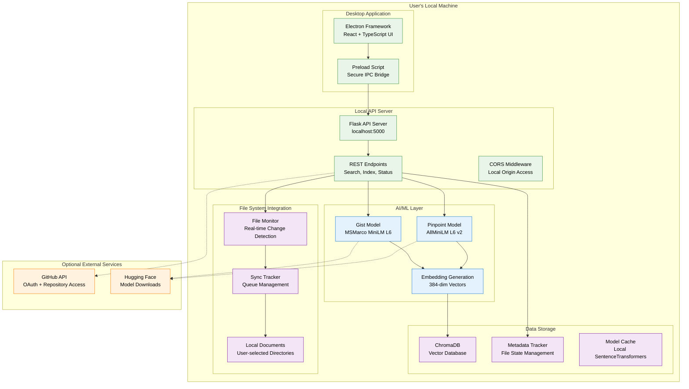
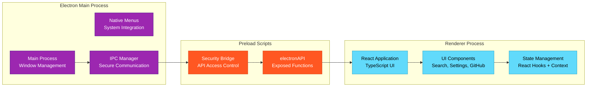
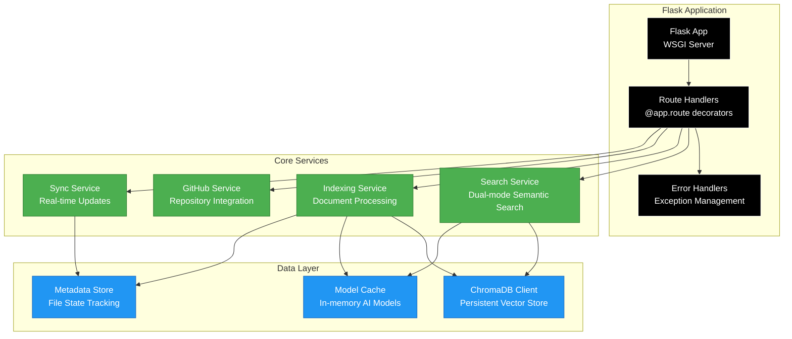
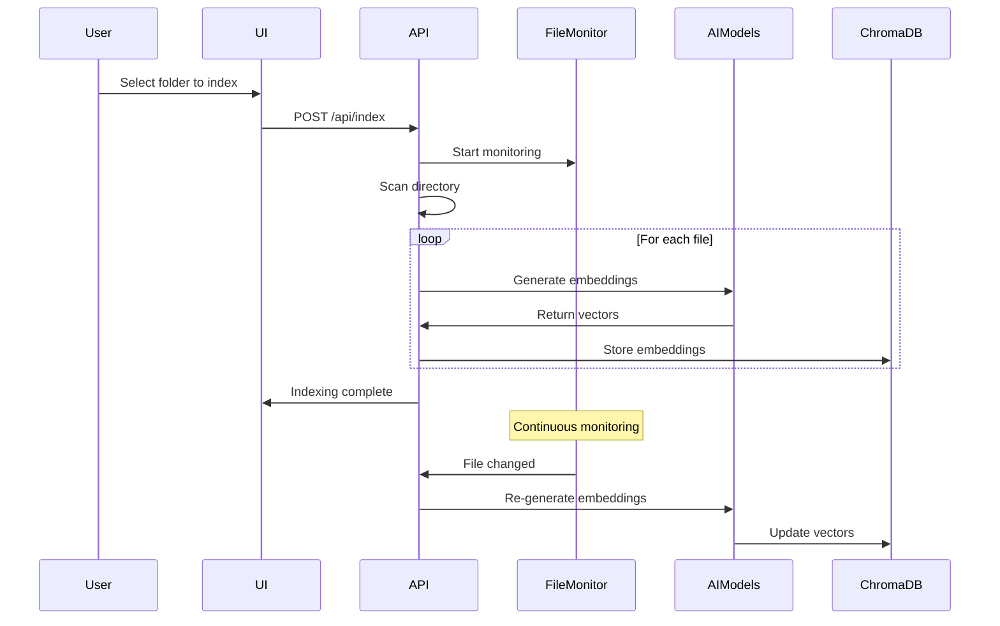
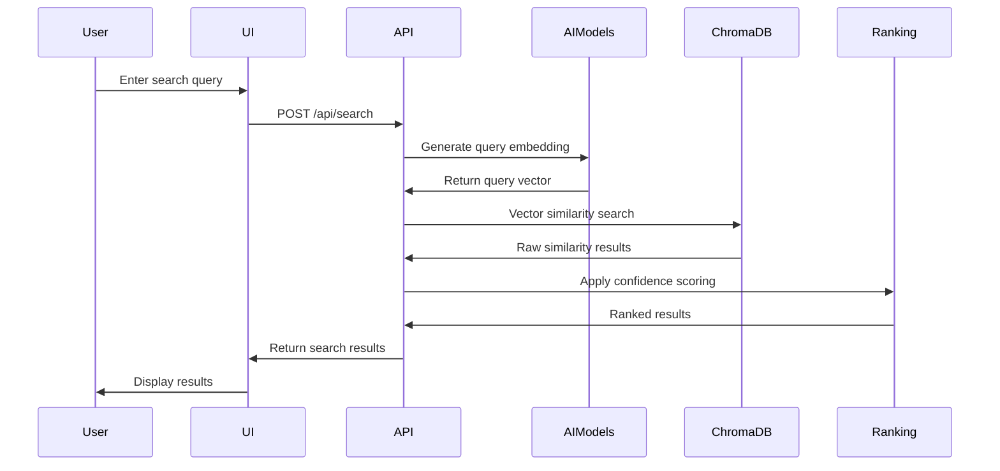

# System Architecture Overview

**Filevate AI-Powered Local Semantic Search Platform**

## 🏗️ **High-Level Architecture**

Filevate is built as a local-first desktop application that combines AI capabilities with modern software architecture to deliver semantic search functionality on the user's machine.

## 🎯 **Core Design Principles**

### **1. Local-First Architecture**
- **All Processing Local**: Document indexing and search happen on user's machine
- **No Cloud Dependencies**: Core functionality works completely offline
- **Privacy by Design**: No document content transmitted externally
- **User Data Ownership**: All indexed data stored locally under user control

### **2. AI-Powered Intelligence**
- **Dual-Model Approach**: Specialized models for different search contexts
- **Semantic Understanding**: Goes beyond keyword matching to understand meaning
- **Confidence Scoring**: Multi-factor ranking algorithm for result relevance
- **Real-time Processing**: Immediate indexing of file changes

### **3. Cross-Platform Compatibility**
- **Desktop Application**: Native experience on Windows, macOS, and Linux
- **Electron Framework**: Modern web technologies with native integration
- **Universal File Support**: 15+ file types with intelligent text extraction
- **Platform-Specific Storage**: Uses OS-appropriate directories for data

## 📊 **System Components**

### **Frontend Architecture**

### **Backend Architecture**

## 🔧 **Technology Stack**

### **Frontend Technologies**
- **Electron**: Cross-platform desktop framework
- **React**: UI library with TypeScript
- **CSS**: Styling with Tailwind CSS
- **Node.js**: JavaScript runtime for desktop app

### **Backend Technologies**
- **Python**: Core programming language
- **Flask**: Lightweight web framework
- **ChromaDB**: Vector database for embeddings
- **SentenceTransformers**: AI model library

### **AI/ML Technologies**
- **MSMarco MiniLM L6**: Optimized for search tasks (Gist mode)
- **AllMiniLM L6 v2**: General semantic understanding (Pinpoint mode)
- **Hugging Face Transformers**: Model loading and inference
- **NumPy**: Vector computations and similarity calculations

### **File System Technologies**
- **Watchdog**: Cross-platform file system monitoring
- **Platform Storage APIs**: OS-specific data directories
- **Multiple Format Support**: PDF, Office docs, text files, code files

## 📈 **Performance Characteristics**

### **Search Performance**
- **Typical Response Time**: 100-300ms for local searches
- **Concurrent Searches**: Handles multiple simultaneous search requests
- **Index Size Scaling**: Tested with collections up to 100K documents
- **Memory Usage**: ~2-4GB depending on collection size and models

### **Indexing Performance**
- **Processing Speed**: 50-100 files per minute (varies by file size)
- **Batch Processing**: Configurable batch sizes for memory efficiency
- **Incremental Updates**: Only processes changed files
- **Background Processing**: Non-blocking indexing with progress updates

### **Resource Requirements**
- **Minimum RAM**: 4GB (8GB recommended)
- **Storage**: ~2GB for models + indexed data size
- **CPU**: Modern multi-core processor for AI inference
- **Network**: Only for initial setup and GitHub integration

## 🔄 **Data Flow Architecture**

### **Document Indexing Flow**

### **Search Flow**

## 🏠 **Local Deployment Model**

### **Single-User Desktop Deployment**
- **Target Environment**: Individual user workstations
- **Installation**: Source installation or future packaged installers
- **Data Storage**: User's application data directory
- **Configuration**: Local config.py file
- **Scaling**: Designed for personal document collections

### **Development Environment**
- **Development Mode**: Flask debug mode with hot reload
- **Testing**: Local test files and validation scripts
- **Debugging**: Console logging and developer tools
- **Performance Profiling**: Built-in timing and memory monitoring

## 🔒 **Security Model**

### **Local-First Security**
- **No External Data Transmission**: Document content stays local
- **OS-Level Security**: Inherits user account permissions
- **Keyring Integration**: Secure storage for GitHub tokens
- **CORS Protection**: API only accepts requests from desktop app

### **GitHub Integration Security**
- **OAuth Device Flow**: Industry-standard authentication
- **Minimal Permissions**: Read-only repository access
- **Token Management**: Secure storage and automatic refresh
- **Repository Cloning**: Local copies for indexing

## 📊 **Current Limitations**

### **Known Constraints**
- **Single-User Design**: No multi-user access control
- **Local Processing Only**: No distributed computing
- **Basic Monitoring**: Console logging only
- **Manual Configuration**: No centralized configuration management

### **Future Enhancement Opportunities**
- **Performance Optimization**: GPU acceleration for large collections
- **Advanced Monitoring**: Metrics collection and visualization
- **Enterprise Features**: Multi-user support and centralized management
- **Cloud Integration**: Optional cloud backup and sync

---

*This architecture overview reflects the current implementation of Filevate as a local-first semantic search platform designed for individual users and development teams.*