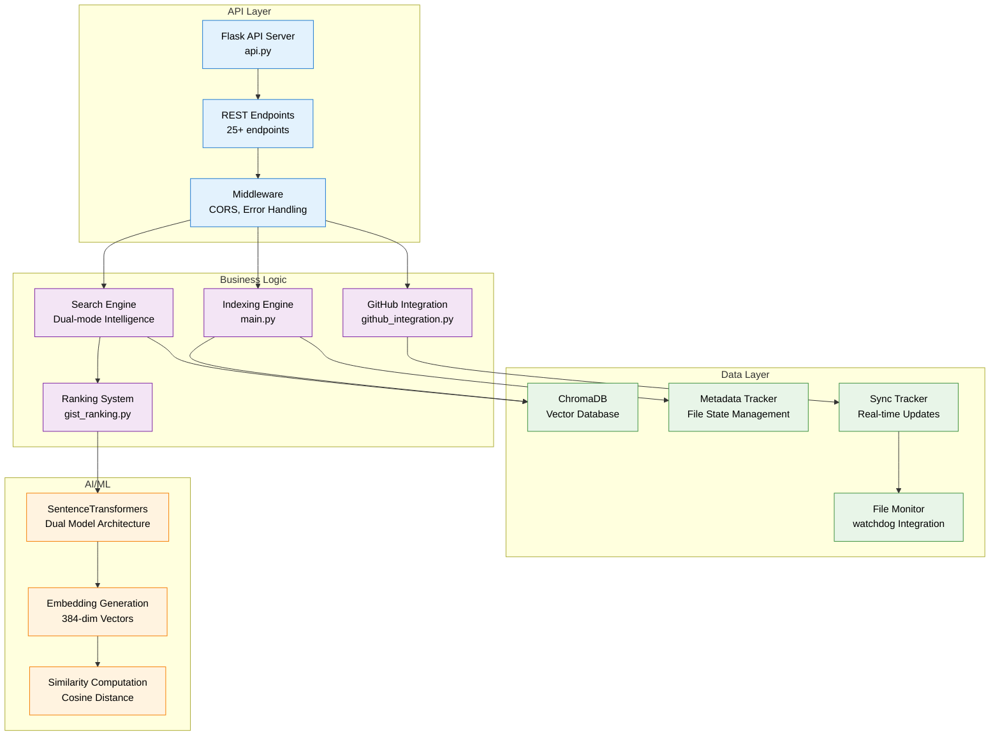
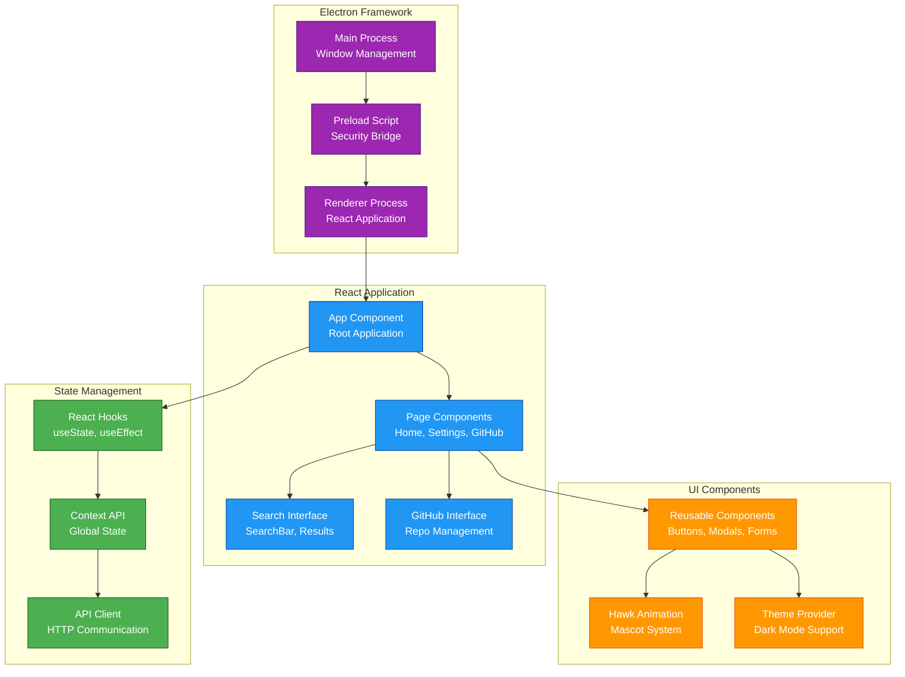

# Developer Getting Started Guide

**Complete guide for developers to set up, understand, and contribute to the Filevate codebase**

## Overview

Filevate is built with modern development practices, comprehensive testing, and a focus on maintainability. This guide will help you get up and running quickly and understand the codebase architecture.

## Quick Start

### **Prerequisites**

```bash
# Required software versions
Python 3.8+ (3.9+ recommended)
Node.js 16+ (for desktop application)
Git 2.20+
```

### **Clone and Setup**

```bash
# Clone the repository
git clone https://github.com/your-org/filevate.git
cd filevate

# Setup Python environment
python3 -m venv venv
source venv/bin/activate  # On Windows: venv\Scripts\activate

# Install Python dependencies
pip install -r requirements.txt

# Setup pre-commit hooks (optional but recommended)
pip install pre-commit
pre-commit install
```

### **Desktop Application Setup**

```bash
# Navigate to desktop app directory
cd desktop-app

# Install Node.js dependencies
npm install

# Start development server
npm start
```

### **Start Backend API**

```bash
# In project root directory
python api.py
```

Your development environment is now ready! The desktop app will be available at `http://localhost:3000` and the API at `http://localhost:5000`.

## Project Architecture

### **High-Level Structure**

```
filevate/
├── api.py                      # Main Flask API server
├── main.py                     # Core indexing engine
├── config.py                   # Configuration management
├── requirements.txt            # Python dependencies
│
├── Core Modules
├── ├── gist_ranking.py         # Advanced ranking algorithms
├── ├── metadata_tracker.py     # File state management
├── ├── sync_tracker.py         # Real-time sync management
├── ├── realtime_monitor.py     # File system monitoring
├── ├── github_integration.py   # GitHub OAuth and repos
├── ├── branch_manifest.py      # Branch-aware indexing
├── └── filtering_utils.py      # Shared filtering logic
│
├── desktop-app/               # Electron + React frontend
├── ├── src/main/              # Electron main process
├── ├── src/renderer/          # React application
├── ├── ├── components/        # UI components
├── ├── ├── utils/            # Utility functions
├── ├── └── types/            # TypeScript definitions
├── └── python-bundle/        # Bundled Python API
│
├── Testing & Validation
├── ├── test_*.py              # Unit and integration tests
├── ├── *_test.py             # Semantic validation tests
├── └── test_confidence_files/ # Test data corpus
│
├── Documentation
├── ├── documentation/         # Complete documentation
├── ├── *.md                  # Legacy docs (being migrated)
├── └── diagrams/             # Architecture diagrams
│
└── Configuration & Deployment
    ├── cleanup.py            # Database cleanup utility
    ├── reset_*.sh           # Development reset scripts
    └── *.json              # Test reports and configs
```

### **Core Components**

#### **Backend Architecture**



#### **Frontend Architecture**



## Development Workflow

### **Git Workflow**

```bash
# Feature development workflow
git checkout main
git pull origin main
git checkout -b feature/your-feature-name

# Make your changes
git add .
git commit -m "feat: add new search filter component"

# Push and create pull request
git push origin feature/your-feature-name
# Then create PR via GitHub web interface
```

### **Branch Naming Convention**

```
feature/feature-name      # New features
fix/issue-description     # Bug fixes  
docs/documentation-update # Documentation changes
refactor/component-name   # Code refactoring
test/test-description     # Test additions
chore/maintenance-task    # Maintenance tasks
```

### **Commit Message Format**

We follow [Conventional Commits](https://www.conventionalcommits.org/):

```
type(scope): description

feat(search): add advanced filtering options
fix(api): resolve memory leak in indexing
docs(readme): update installation instructions
test(integration): add GitHub OAuth flow tests
refactor(ui): simplify component hierarchy
chore(deps): update sentence-transformers to 2.2.2
```

## Development Environment

### **Code Quality Tools**

```bash
# Python code formatting and linting
pip install black isort flake8 mypy

# Format Python code
black .
isort .

# Lint Python code
flake8 .
mypy .

# TypeScript/JavaScript formatting
cd desktop-app
npm run lint
npm run format
```

### **Pre-commit Hooks**

```yaml
# .pre-commit-config.yaml
repos:
  - repo: https://github.com/psf/black
    rev: 22.3.0
    hooks:
      - id: black
        language_version: python3

  - repo: https://github.com/pycqa/isort
    rev: 5.10.1
    hooks:
      - id: isort

  - repo: https://github.com/pycqa/flake8
    rev: 4.0.1
    hooks:
      - id: flake8

  - repo: https://github.com/pre-commit/mirrors-prettier
    rev: v2.6.2
    hooks:
      - id: prettier
        files: \.(js|ts|tsx|json|css|md)$
```

### **Testing Strategy**

```bash
# Run Python tests
python -m pytest tests/ -v

# Run specific test file
python test_api.py

# Run semantic validation tests
python run_comprehensive_semantic_validation.py

# Run performance benchmarks
python test_search_comparison.py

# Run JavaScript/TypeScript tests
cd desktop-app
npm test
```

## Key Development Concepts

### **Dual-Mode Search Architecture**

Filevate implements two complementary search modes:

```python
# Gist Mode - Topic-level understanding
class GistMode:
    """
    Optimized for comprehensive document understanding and topic discovery.
    
    Characteristics:
    - 35-line chunk size for broader context
    - MSMarco MiniLM model for search optimization
    - Multi-factor ranking with file-level intelligence
    - Ideal for research and exploratory search
    """
    
    def search(self, query: str) -> List[SearchResult]:
        # 1. Generate query embedding with MSMarco model
        # 2. Search file centroids for candidate files
        # 3. Perform detailed chunk analysis
        # 4. Apply multi-factor ranking algorithm
        # 5. Return ranked results with confidence scores
        pass

# Pinpoint Mode - Precise information location  
class PinpointMode:
    """
    Optimized for exact information retrieval and specific details.
    
    Characteristics:
    - 10-line chunk size for precise location
    - AllMiniLM model for general semantic understanding
    - Direct confidence scoring for accuracy
    - Ideal for fact-finding and specific information
    """
    
    def search(self, query: str) -> List[SearchResult]:
        # 1. Generate query embedding with AllMiniLM model
        # 2. Direct chunk similarity search
        # 3. Rank by confidence scores
        # 4. Return precise results with evidence
        pass
```

### **Real-time Synchronization**

```python
# File monitoring and sync architecture
class RealtimeSync:
    """
    Real-time file change detection and intelligent synchronization.
    
    Components:
    - FileSystemWatcher: Detects file changes using watchdog
    - SyncTracker: Manages queue of files needing reindexing
    - MetadataTracker: Tracks file state with SHA-256 hashing
    - BranchManifest: Git-aware change detection
    """
    
    def handle_file_change(self, event: FileChangeEvent):
        # 1. Debounce rapid changes (500ms window)
        # 2. Filter out temporary/system files
        # 3. Check if file actually changed (SHA-256)
        # 4. Queue for reindexing with appropriate priority
        # 5. Update metadata and sync status
        pass
```

### **GitHub Integration Architecture**

```python
# GitHub OAuth and repository management
class GitHubIntegration:
    """
    Comprehensive GitHub integration with OAuth device flow.
    
    Features:
    - OAuth 2.0 device flow for secure authentication
    - Repository discovery across organizations
    - Branch-aware indexing with manifests
    - Real-time synchronization with webhooks
    - Intelligent change detection
    """
    
    def authenticate_user(self) -> AuthResult:
        # 1. Initiate OAuth device flow
        # 2. Display user code and verification URL
        # 3. Poll for authorization completion
        # 4. Store access token securely (keyring)
        # 5. Return authentication status
        pass
    
    def sync_repository(self, repo: GitHubRepo) -> SyncResult:
        # 1. Check for branch changes using manifests
        # 2. Clone or update repository locally
        # 3. Identify changed files since last sync
        # 4. Queue changed files for reindexing
        # 5. Update branch manifest
        pass
```

## API Development Guide

### **Adding New Endpoints**

```python
# api.py - Adding new REST endpoints
@app.route('/api/your-endpoint', methods=['POST'])
def your_endpoint():
    """
    Template for new API endpoints.
    
    Always include:
    - Input validation
    - Error handling
    - Logging
    - Response formatting
    - Performance metrics
    """
    
    try:
        # 1. Validate request data
        data = request.get_json()
        if not data or 'required_field' not in data:
            return jsonify({'error': 'Missing required field'}), 400
        
        # 2. Process request
        result = your_business_logic(data)
        
        # 3. Log operation
        logger.info(f"Your endpoint processed successfully: {data['id']}")
        
        # 4. Return formatted response
        return jsonify({
            'success': True,
            'data': result,
            'timestamp': datetime.now().isoformat()
        })
        
    except Exception as e:
        # 5. Handle errors gracefully
        logger.error(f"Your endpoint failed: {str(e)}")
        return jsonify({
            'error': 'Internal server error',
            'message': str(e)
        }), 500
```

### **API Design Principles**

```yaml
REST API Guidelines:
  ✅ Use standard HTTP methods (GET, POST, PUT, DELETE)
  ✅ Return appropriate HTTP status codes
  ✅ Include error details in response body
  ✅ Use consistent response format
  ✅ Implement request validation
  ✅ Add comprehensive logging
  ✅ Include performance timing
  ✅ Handle edge cases gracefully

Response Format Standard:
  Success: {"success": true, "data": {...}, "metadata": {...}}
  Error: {"error": "Error message", "details": "...", "timestamp": "..."}
```

## Frontend Development Guide

### **React Component Structure**

```typescript
// components/ExampleComponent.tsx
import React, { useState, useEffect } from 'react';
import { SearchResult } from '../types';

interface ExampleComponentProps {
  results: SearchResult[];
  onResultClick: (result: SearchResult) => void;
  isLoading?: boolean;
}

export const ExampleComponent: React.FC<ExampleComponentProps> = ({
  results,
  onResultClick,
  isLoading = false
}) => {
  const [selectedResult, setSelectedResult] = useState<SearchResult | null>(null);

  useEffect(() => {
    // Component lifecycle logic
  }, [results]);

  const handleResultSelection = (result: SearchResult) => {
    setSelectedResult(result);
    onResultClick(result);
  };

  if (isLoading) {
    return <div className="loading-spinner">Loading...</div>;
  }

  return (
    <div className="example-component">
      {results.map((result) => (
        <div
          key={result.file_path}
          className={`result-item ${selectedResult?.file_path === result.file_path ? 'selected' : ''}`}
          onClick={() => handleResultSelection(result)}
        >
          <h3>{result.file_name}</h3>
          <p>Confidence: {Math.round(result.confidence * 100)}%</p>
          <p>{result.snippet}</p>
        </div>
      ))}
    </div>
  );
};
```

### **State Management Patterns**

```typescript
// Custom hooks for state management
export const useSearchState = () => {
  const [query, setQuery] = useState('');
  const [results, setResults] = useState<SearchResult[]>([]);
  const [isLoading, setIsLoading] = useState(false);
  const [error, setError] = useState<string | null>(null);

  const performSearch = async (searchQuery: string, mode: 'gist' | 'pinpoint') => {
    setIsLoading(true);
    setError(null);

    try {
      const response = await window.electronAPI.apiRequest('/api/search', {
        method: 'POST',
        headers: { 'Content-Type': 'application/json' },
        body: JSON.stringify({ query: searchQuery, mode })
      });

      const data = await response.json();
      
      if (response.ok) {
        setResults(data.results || []);
      } else {
        setError(data.error || 'Search failed');
      }
    } catch (err) {
      setError('Network error occurred');
    } finally {
      setIsLoading(false);
    }
  };

  return {
    query,
    setQuery,
    results,
    isLoading,
    error,
    performSearch
  };
};
```

## Testing Guidelines

### **Writing Unit Tests**

```python
# test_example.py
import pytest
from unittest.mock import Mock, patch
from your_module import YourClass

class TestYourClass:
    """Test suite for YourClass functionality."""
    
    def setup_method(self):
        """Setup test fixtures before each test."""
        self.instance = YourClass()
        self.mock_data = {'test': 'data'}
    
    def test_successful_operation(self):
        """Test successful operation with valid input."""
        # Arrange
        input_data = {'valid': 'input'}
        expected_result = {'expected': 'output'}
        
        # Act
        result = self.instance.process(input_data)
        
        # Assert
        assert result == expected_result
        assert self.instance.state == 'processed'
    
    def test_error_handling(self):
        """Test error handling with invalid input."""
        # Arrange
        invalid_input = None
        
        # Act & Assert
        with pytest.raises(ValueError, match="Input cannot be None"):
            self.instance.process(invalid_input)
    
    @patch('your_module.external_service')
    def test_with_mocked_dependency(self, mock_service):
        """Test with mocked external dependencies."""
        # Arrange
        mock_service.return_value = {'mocked': 'response'}
        
        # Act
        result = self.instance.process_with_service()
        
        # Assert
        mock_service.assert_called_once()
        assert result['mocked'] == 'response'
```

### **Integration Testing**

```python
# test_integration.py
import requests
import pytest

class TestAPIIntegration:
    """Integration tests for API endpoints."""
    
    @pytest.fixture
    def api_client(self):
        """Create API client for testing."""
        return APITestClient(base_url='http://localhost:5000')
    
    def test_search_endpoint_integration(self, api_client):
        """Test complete search workflow."""
        # Test search request
        response = api_client.post('/api/search', {
            'query': 'machine learning',
            'mode': 'gist',
            'limit': 10
        })
        
        assert response.status_code == 200
        data = response.json()
        
        assert 'results' in data
        assert 'metadata' in data
        assert isinstance(data['results'], list)
        
        # Validate result structure
        if data['results']:
            result = data['results'][0]
            required_fields = ['file_name', 'file_path', 'confidence', 'snippet']
            for field in required_fields:
                assert field in result
```

## Performance Optimization

### **Backend Performance**

```python
# Performance optimization patterns
import time
import functools
from typing import Dict, Any

def performance_monitor(func):
    """Decorator to monitor function performance."""
    @functools.wraps(func)
    def wrapper(*args, **kwargs):
        start_time = time.time()
        try:
            result = func(*args, **kwargs)
            duration = time.time() - start_time
            
            # Log slow operations
            if duration > 1.0:  # 1 second threshold
                logger.warning(f"Slow operation: {func.__name__} took {duration:.2f}s")
            
            return result
        except Exception as e:
            duration = time.time() - start_time
            logger.error(f"Failed operation: {func.__name__} failed after {duration:.2f}s: {e}")
            raise
    
    return wrapper

class PerformanceOptimizer:
    """Performance optimization utilities."""
    
    @staticmethod
    def batch_process(items: list, batch_size: int = 50):
        """Process items in batches for memory efficiency."""
        for i in range(0, len(items), batch_size):
            yield items[i:i + batch_size]
    
    @staticmethod
    def memoize_with_ttl(ttl_seconds: int = 300):
        """Memoization decorator with time-to-live."""
        def decorator(func):
            cache = {}
            
            @functools.wraps(func)
            def wrapper(*args, **kwargs):
                key = str(args) + str(sorted(kwargs.items()))
                current_time = time.time()
                
                if key in cache:
                    result, timestamp = cache[key]
                    if current_time - timestamp < ttl_seconds:
                        return result
                
                result = func(*args, **kwargs)
                cache[key] = (result, current_time)
                return result
            
            return wrapper
        return decorator
```

### **Frontend Performance**

```typescript
// React performance optimization patterns
import React, { memo, useMemo, useCallback } from 'react';

// Memoized component for expensive renders
export const ExpensiveComponent = memo<Props>(({ data, onAction }) => {
  // Memoize expensive calculations
  const processedData = useMemo(() => {
    return data.map(item => complexProcessing(item));
  }, [data]);

  // Memoize event handlers
  const handleAction = useCallback((item: DataItem) => {
    onAction(item);
  }, [onAction]);

  return (
    <div>
      {processedData.map(item => (
        <ItemComponent 
          key={item.id}
          item={item}
          onAction={handleAction}
        />
      ))}
    </div>
  );
});

// Virtual scrolling for large lists
export const VirtualizedList: React.FC<ListProps> = ({ items }) => {
  const [visibleRange, setVisibleRange] = useState({ start: 0, end: 50 });

  const visibleItems = useMemo(() => {
    return items.slice(visibleRange.start, visibleRange.end);
  }, [items, visibleRange]);

  return (
    <div className="virtualized-container">
      {visibleItems.map(item => (
        <ListItem key={item.id} item={item} />
      ))}
    </div>
  );
};
```

## Debugging and Troubleshooting

### **Common Development Issues**

```yaml
Python Environment Issues:
  Problem: "Module not found" errors
  Solution: Ensure virtual environment is activated and dependencies installed
  Command: source venv/bin/activate && pip install -r requirements.txt

  Problem: ChromaDB connection errors
  Solution: Clear database and restart
  Command: python cleanup.py && python api.py

API Server Issues:
  Problem: "Port already in use" error
  Solution: Kill existing processes and restart
  Command: lsof -ti:5000 | xargs kill -9

Desktop App Issues:
  Problem: "Failed to connect to API" error
  Solution: Ensure API server is running on localhost:5000
  Check: curl http://localhost:5000/api/health

GitHub Integration Issues:
  Problem: OAuth authentication fails
  Solution: Clear stored tokens and re-authenticate
  Command: python -c "import keyring; keyring.delete_password('filesearcher', 'github_token')"
```

### **Debugging Tools**

```python
# debug_tools.py - Development debugging utilities
import json
import pprint
from typing import Any

class DebugTools:
    """Development debugging and inspection tools."""
    
    @staticmethod
    def inspect_search_results(results: list) -> None:
        """Pretty print search results for debugging."""
        print("=" * 50)
        print(f"SEARCH RESULTS ({len(results)} items)")
        print("=" * 50)
        
        for i, result in enumerate(results):
            print(f"\n{i+1}. {result.get('file_name', 'Unknown')}")
            print(f"   Confidence: {result.get('confidence', 0):.2%}")
            print(f"   Path: {result.get('file_path', 'Unknown')}")
            print(f"   Snippet: {result.get('snippet', '')[:100]}...")
    
    @staticmethod
    def debug_api_request(endpoint: str, data: dict) -> None:
        """Debug API request/response."""
        print(f"\n=== API DEBUG: {endpoint} ===")
        print("Request Data:")
        pprint.pprint(data, width=80, depth=3)
        
        try:
            import requests
            response = requests.post(f'http://localhost:5000{endpoint}', json=data)
            print(f"\nResponse Status: {response.status_code}")
            print("Response Data:")
            pprint.pprint(response.json(), width=80, depth=3)
        except Exception as e:
            print(f"Request failed: {e}")
    
    @staticmethod
    def profile_function_performance(func, *args, **kwargs):
        """Profile function performance with detailed timing."""
        import cProfile
        import io
        import pstats
        
        profiler = cProfile.Profile()
        profiler.enable()
        
        result = func(*args, **kwargs)
        
        profiler.disable()
        
        # Print profiling results
        stream = io.StringIO()
        stats = pstats.Stats(profiler, stream=stream)
        stats.sort_stats('cumulative').print_stats(20)
        
        print(f"\n=== PERFORMANCE PROFILE: {func.__name__} ===")
        print(stream.getvalue())
        
        return result
```

---

*This developer guide provides comprehensive information for contributing to Filevate, from initial setup through advanced development patterns and debugging techniques.*
