# Confidence Scoring Algorithm

**Multi-Factor Confidence Calculation for Search Results**

## Overview

This diagram illustrates the sophisticated confidence scoring algorithm used in Filevate to rank search results with high accuracy and user-friendly confidence percentages.

```mermaid
flowchart TD
    %% Input
    RAW_RESULTS[🔍 Raw ChromaDB Results<br/>Cosine Distance Scores]
    QUERY_TERMS[📝 Query Terms<br/>Normalized Words]
    FILE_INFO[📄 File Information<br/>Name, Path, Content]
    
    %% Distance Processing
    DISTANCE_CONVERT[Distance Conversion<br/>Cosine → Similarity]
    BASE_CONFIDENCE[Base Confidence<br/>0-1 Normalization]
    
    %% Gist Mode Scoring
    GIST_RANKING{Gist Mode?}
    MULTI_FACTOR[Multi-Factor Scoring<br/>14 Algorithm Components]
    
    subgraph "Gist Ranking Components"
        S_MAX[s_max<br/>Best Chunk Score]
        S_TOPK[s_topk_mean<br/>Top-K Average]
        S_CENTROID[s_centroid<br/>File Centroid Score]
        S_BM25[s_bm25<br/>BM25 Text Score]
        COVERAGE[Coverage Factor<br/>Query Term Overlap]
        LENGTH_NORM[Length Normalization<br/>File Size Compensation]
    end
    
    %% Boosting Factors
    FILENAME_BOOST[Filename Matching<br/>AI Semantic Similarity]
    EXACT_TERM_BOOST[Exact Term Matching<br/>Word Overlap Bonus]
    MULTI_CHUNK_BOOST[Multi-Chunk Boost<br/>Multiple Relevant Chunks]
    
    %% Quality Assessment
    QUALITY_TIER[Quality Tier Assessment<br/>High/Medium/Low]
    SEMANTIC_THRESHOLD[Semantic Quality Check<br/>Relevance Validation]
    
    %% Final Score
    WEIGHTED_COMBINATION[Weighted Score Combination<br/>Factor Integration]
    CONFIDENCE_CALIBRATION[Confidence Calibration<br/>User-Friendly 0-100%]
    FINAL_SCORE[📊 Final Confidence Score<br/>Percentage Display]
    
    %% Flow
    RAW_RESULTS --> DISTANCE_CONVERT
    DISTANCE_CONVERT --> BASE_CONFIDENCE
    BASE_CONFIDENCE --> GIST_RANKING
    
    GIST_RANKING -->|Yes| MULTI_FACTOR
    GIST_RANKING -->|No| FILENAME_BOOST
    
    MULTI_FACTOR --> S_MAX
    MULTI_FACTOR --> S_TOPK
    MULTI_FACTOR --> S_CENTROID
    MULTI_FACTOR --> S_BM25
    MULTI_FACTOR --> COVERAGE
    MULTI_FACTOR --> LENGTH_NORM
    
    S_MAX --> FILENAME_BOOST
    S_TOPK --> FILENAME_BOOST
    S_CENTROID --> FILENAME_BOOST
    S_BM25 --> FILENAME_BOOST
    COVERAGE --> FILENAME_BOOST
    LENGTH_NORM --> FILENAME_BOOST
    
    QUERY_TERMS --> EXACT_TERM_BOOST
    FILE_INFO --> FILENAME_BOOST
    FILE_INFO --> EXACT_TERM_BOOST
    FILE_INFO --> MULTI_CHUNK_BOOST
    
    FILENAME_BOOST --> QUALITY_TIER
    EXACT_TERM_BOOST --> QUALITY_TIER
    MULTI_CHUNK_BOOST --> QUALITY_TIER
    
    QUALITY_TIER --> SEMANTIC_THRESHOLD
    SEMANTIC_THRESHOLD --> WEIGHTED_COMBINATION
    WEIGHTED_COMBINATION --> CONFIDENCE_CALIBRATION
    CONFIDENCE_CALIBRATION --> FINAL_SCORE

    %% Styling
    classDef input fill:#E3F2FD,stroke:#1976D2,color:#000
    classDef processing fill:#E8F5E8,stroke:#388E3C,color:#000
    classDef gist fill:#F3E5F5,stroke:#7B1FA2,color:#000
    classDef boost fill:#FFF3E0,stroke:#F57C00,color:#000
    classDef quality fill:#FCE4EC,stroke:#C2185B,color:#000
    classDef output fill:#F1F8E9,stroke:#689F38,color:#000

    class RAW_RESULTS,QUERY_TERMS,FILE_INFO input
    class DISTANCE_CONVERT,BASE_CONFIDENCE,GIST_RANKING processing
    class MULTI_FACTOR,S_MAX,S_TOPK,S_CENTROID,S_BM25,COVERAGE,LENGTH_NORM gist
    class FILENAME_BOOST,EXACT_TERM_BOOST,MULTI_CHUNK_BOOST boost
    class QUALITY_TIER,SEMANTIC_THRESHOLD quality
    class WEIGHTED_COMBINATION,CONFIDENCE_CALIBRATION,FINAL_SCORE output
```



## Algorithm Components

### **1. Base Confidence Calculation**
- **Distance Conversion**: Convert ChromaDB cosine distances to similarity scores
- **Normalization**: Scale raw scores to 0-1 confidence range
- **Adaptive Mapping**: Handle varying distance ranges dynamically

### **2. Gist Mode Multi-Factor Scoring**
- **s_max**: Best individual chunk score (peak relevance)
- **s_topk_mean**: Average of top-K chunks (consistency measure)
- **s_centroid**: File-level centroid similarity (topic alignment)
- **s_bm25**: BM25 text scoring (term frequency relevance)
- **Coverage**: Query term coverage across chunks
- **Length Normalization**: Compensation for file size bias

### **3. Boosting Factors**
- **Filename Matching**: AI-driven semantic similarity between query and filename
- **Exact Term Matching**: Direct word overlap bonus
- **Multi-Chunk Boost**: Files with multiple relevant chunks get priority

### **4. Quality Assessment**
- **Semantic Thresholds**: Minimum relevance requirements
- **Quality Tiers**: High (>60%), Medium (30-60%), Low (<30%)
- **Relevance Validation**: Ensure semantic quality standards

### **5. Score Calibration**
- **Weighted Combination**: Intelligent factor weighting
- **User-Friendly Display**: 0-100% confidence scores
- **Threshold-Based Categories**: High/Medium/Low confidence badges

## Mathematical Foundation

### **Gist Mode Formula**
```
confidence = weighted_sum(
    s_max * w_max,
    s_topk_mean * w_topk,
    s_centroid * w_centroid,
    s_bm25 * w_bm25
) * coverage_factor * length_norm * boost_factors
```

### **Boost Calculations**
```
filename_boost = AI_semantic_similarity(query, filename)
exact_term_boost = overlap_ratio(query_terms, content_terms)
multi_chunk_boost = quality_weighted_chunk_count
```

### **Quality Thresholds**
- **High Confidence**: ≥60% (Green badge)
- **Medium Confidence**: 30-59% (Yellow badge)  
- **Low Confidence**: <30% (Red badge)

## Performance Characteristics

### **Accuracy Metrics**
- **Semantic Relevance**: High correlation with human judgments
- **Ranking Quality**: Consistent ordering of results by relevance
- **Score Distribution**: Well-distributed across confidence ranges
- **User Experience**: Intuitive percentage-based scores

### **Computational Efficiency**
- **Real-time Calculation**: Sub-millisecond scoring for typical result sets
- **Scalable Processing**: Efficient with large result sets
- **Memory Efficient**: Minimal memory overhead
- **Batch Optimization**: Vectorized operations where possible

---

*This confidence scoring algorithm ensures accurate and intuitive result ranking in Filevate's semantic search platform.*
