# Indexing Pipeline Algorithm

**Document Processing and Vector Storage Flow**

## Overview

This diagram shows the complete indexing pipeline that processes documents and creates searchable vector representations in Filevate.

```mermaid
flowchart TD
    %% Input Sources
    LOCAL_FOLDER[📁 Local Folders<br/>User-Selected Directories]
    GITHUB_REPO[🔗 GitHub Repositories<br/>Cloned Locally]
    FILE_CHANGES[⚡ File Changes<br/>Real-time Detection]
    
    %% File Discovery
    SCAN_DIRS[Directory Scanner<br/>Recursive File Discovery]
    FILE_FILTER[File Filter<br/>Type & Size Validation]
    EXCLUSION_CHECK[Exclusion Check<br/>Skip Hidden/System Files]
    
    %% File Processing
    FILE_READ[File Reader<br/>Content Extraction]
    TEXT_EXTRACT[Text Extraction<br/>15+ File Types Supported]
    ENCODING_DETECT[Encoding Detection<br/>UTF-8, ASCII, etc.]
    
    %% Content Processing
    CONTENT_CLEAN[Content Cleaning<br/>Remove Artifacts]
    DUAL_CHUNKING[Dual-Mode Chunking<br/>Gist + Pinpoint]
    GIST_CHUNKS[Gist Chunks<br/>35-line Segments]
    PINPOINT_CHUNKS[Pinpoint Chunks<br/>10-line Segments]
    
    %% Metadata Generation
    METADATA_GEN[Metadata Generation<br/>File Path, Size, Hash]
    SHA256_HASH[SHA-256 Hashing<br/>Change Detection]
    TIMESTAMP[Timestamp Recording<br/>Modified Date]
    
    %% AI Processing
    GIST_EMBED[Gist Embedding<br/>MSMarco Model]
    PINPOINT_EMBED[Pinpoint Embedding<br/>AllMiniLM Model]
    VECTOR_GEN[Vector Generation<br/>384-Dimensional]
    
    %% Storage
    CHROMA_GIST[ChromaDB Gist Collection<br/>Topic-level Storage]
    CHROMA_PINPOINT[ChromaDB Pinpoint Collection<br/>Precise Storage]
    METADATA_STORE[Metadata Store<br/>File State Tracking]
    
    %% Progress Tracking
    PROGRESS_UPDATE[Progress Updates<br/>Real-time Feedback]
    STATUS_BROADCAST[Status Broadcast<br/>UI Notifications]
    
    %% Error Handling
    ERROR_CHECK{Processing<br/>Successful?}
    ERROR_LOG[Error Logging<br/>Failed File Tracking]
    RETRY_QUEUE[Retry Queue<br/>Failure Recovery]
    
    %% Flow Connections
    LOCAL_FOLDER --> SCAN_DIRS
    GITHUB_REPO --> SCAN_DIRS
    FILE_CHANGES --> FILE_FILTER
    
    SCAN_DIRS --> FILE_FILTER
    FILE_FILTER --> EXCLUSION_CHECK
    EXCLUSION_CHECK --> FILE_READ
    
    FILE_READ --> TEXT_EXTRACT
    TEXT_EXTRACT --> ENCODING_DETECT
    ENCODING_DETECT --> CONTENT_CLEAN
    
    CONTENT_CLEAN --> DUAL_CHUNKING
    DUAL_CHUNKING --> GIST_CHUNKS
    DUAL_CHUNKING --> PINPOINT_CHUNKS
    
    FILE_READ --> METADATA_GEN
    METADATA_GEN --> SHA256_HASH
    METADATA_GEN --> TIMESTAMP
    
    GIST_CHUNKS --> GIST_EMBED
    PINPOINT_CHUNKS --> PINPOINT_EMBED
    GIST_EMBED --> VECTOR_GEN
    PINPOINT_EMBED --> VECTOR_GEN
    
    VECTOR_GEN --> CHROMA_GIST
    VECTOR_GEN --> CHROMA_PINPOINT
    SHA256_HASH --> METADATA_STORE
    TIMESTAMP --> METADATA_STORE
    
    VECTOR_GEN --> PROGRESS_UPDATE
    PROGRESS_UPDATE --> STATUS_BROADCAST
    
    VECTOR_GEN --> ERROR_CHECK
    ERROR_CHECK -->|Success| PROGRESS_UPDATE
    ERROR_CHECK -->|Failure| ERROR_LOG
    ERROR_LOG --> RETRY_QUEUE

    %% Styling
    classDef input fill:#E3F2FD,stroke:#1976D2,color:#000
    classDef discovery fill:#F3E5F5,stroke:#7B1FA2,color:#000
    classDef processing fill:#E8F5E8,stroke:#388E3C,color:#000
    classDef chunking fill:#FFF3E0,stroke:#F57C00,color:#000
    classDef metadata fill:#FCE4EC,stroke:#C2185B,color:#000
    classDef ai fill:#F1F8E9,stroke:#689F38,color:#000
    classDef storage fill:#E0F2F1,stroke:#00796B,color:#000
    classDef feedback fill:#FFF8E1,stroke:#F9A825,color:#000
    classDef error fill:#FFEBEE,stroke:#D32F2F,color:#000

    class LOCAL_FOLDER,GITHUB_REPO,FILE_CHANGES input
    class SCAN_DIRS,FILE_FILTER,EXCLUSION_CHECK discovery
    class FILE_READ,TEXT_EXTRACT,ENCODING_DETECT,CONTENT_CLEAN processing
    class DUAL_CHUNKING,GIST_CHUNKS,PINPOINT_CHUNKS chunking
    class METADATA_GEN,SHA256_HASH,TIMESTAMP metadata
    class GIST_EMBED,PINPOINT_EMBED,VECTOR_GEN ai
    class CHROMA_GIST,CHROMA_PINPOINT,METADATA_STORE storage
    class PROGRESS_UPDATE,STATUS_BROADCAST feedback
    class ERROR_CHECK,ERROR_LOG,RETRY_QUEUE error
```

## Pipeline Stages

### **1. File Discovery**
- **Directory Scanning**: Recursive traversal of selected folders
- **File Filtering**: Validate file types and sizes
- **Exclusion Logic**: Skip hidden files, system files, and build artifacts

### **2. Content Extraction**
- **Multi-format Support**: PDF, Office docs, code files, text files
- **Text Extraction**: Intelligent content parsing
- **Encoding Detection**: Handle various text encodings

### **3. Content Processing**
- **Cleaning**: Remove formatting artifacts and noise
- **Dual Chunking**: Create both gist and pinpoint chunks
- **Overlap Management**: Configurable chunk overlap

### **4. Metadata Generation**
- **File Metadata**: Path, size, modification time
- **Content Hashing**: SHA-256 for change detection
- **State Tracking**: Track processing status

### **5. AI Processing**
- **Model Selection**: Choose appropriate model for chunk type
- **Embedding Generation**: Create 384-dimensional vectors
- **Batch Processing**: Efficient processing of multiple chunks

### **6. Vector Storage**
- **Collection Management**: Separate gist and pinpoint collections
- **Metadata Association**: Link vectors to file metadata
- **Persistent Storage**: Automatic database persistence

### **7. Progress & Error Handling**
- **Real-time Updates**: Progress broadcast to UI
- **Error Recovery**: Retry failed operations
- **Status Tracking**: Comprehensive operation logging

## Performance Optimizations

### **Batch Processing**
- **Configurable Batch Size**: Balance memory usage and speed
- **Parallel Processing**: Multi-threaded file processing
- **Memory Management**: Efficient resource utilization

### **Change Detection**
- **SHA-256 Hashing**: Detect content changes efficiently
- **Incremental Updates**: Only process modified files
- **Metadata Tracking**: Skip unchanged files

### **Error Resilience**
- **Graceful Failure**: Continue processing on individual file errors
- **Retry Logic**: Attempt recovery for transient failures
- **Progress Preservation**: Resume from last successful state

---

*This indexing pipeline diagram reflects the current document processing implementation in Filevate.*
