# Search Algorithm Flow

**Dual-Mode Semantic Search Process Flow**

## Overview

This diagram illustrates the complete search algorithm flow in Filevate, showing how queries are processed through the dual-model AI architecture to produce ranked results.

```mermaid
flowchart TD
    %% Input
    USER_QUERY[🔍 User Query<br/>Natural Language Input]
    
    %% Mode Selection
    MODE_DETECT{Search Mode<br/>Selection}
    GIST_MODE[📊 Gist Mode<br/>Topic Understanding]
    PINPOINT_MODE[🎯 Pinpoint Mode<br/>Precise Location]
    
    %% Query Processing
    QUERY_CLEAN[Query Preprocessing<br/>Normalize & Clean]
    STOP_WORDS[Stop Word Handling<br/>Filter Common Words]
    QUERY_EMBED[Query Embedding<br/>Generate Vector]
    
    %% Model Selection
    MSMARCO_MODEL[MSMarco MiniLM<br/>Search-Optimized Model]
    ALLMINI_MODEL[AllMiniLM<br/>General Semantic Model]
    
    %% Vector Search
    VECTOR_SEARCH[ChromaDB Vector Search<br/>Cosine Similarity]
    RAW_RESULTS[Raw Similarity Results<br/>Distance Scores]
    
    %% Result Processing
    GIST_RANKING[Gist Ranking Algorithm<br/>Multi-factor Scoring]
    PINPOINT_RANKING[Pinpoint Ranking<br/>Direct Confidence]
    
    %% Confidence Calculation
    CONFIDENCE_CALC[Confidence Calculation<br/>0-1 Score Normalization]
    BOOST_FACTORS[Boosting Factors<br/>Filename + Content Matching]
    
    %% Final Results
    RANKED_RESULTS[📋 Ranked Results<br/>Confidence-Ordered List]
    
    %% Flow Connections
    USER_QUERY --> MODE_DETECT
    MODE_DETECT -->|Gist| GIST_MODE
    MODE_DETECT -->|Pinpoint| PINPOINT_MODE
    
    GIST_MODE --> QUERY_CLEAN
    PINPOINT_MODE --> QUERY_CLEAN
    QUERY_CLEAN --> STOP_WORDS
    STOP_WORDS --> QUERY_EMBED
    
    QUERY_EMBED -->|Gist| MSMARCO_MODEL
    QUERY_EMBED -->|Pinpoint| ALLMINI_MODEL
    
    MSMARCO_MODEL --> VECTOR_SEARCH
    ALLMINI_MODEL --> VECTOR_SEARCH
    VECTOR_SEARCH --> RAW_RESULTS
    
    RAW_RESULTS -->|Gist| GIST_RANKING
    RAW_RESULTS -->|Pinpoint| PINPOINT_RANKING
    
    GIST_RANKING --> CONFIDENCE_CALC
    PINPOINT_RANKING --> CONFIDENCE_CALC
    CONFIDENCE_CALC --> BOOST_FACTORS
    BOOST_FACTORS --> RANKED_RESULTS

    %% Styling
    classDef input fill:#E3F2FD,stroke:#1976D2,color:#000
    classDef mode fill:#F3E5F5,stroke:#7B1FA2,color:#000
    classDef processing fill:#E8F5E8,stroke:#388E3C,color:#000
    classDef ai fill:#FFF3E0,stroke:#F57C00,color:#000
    classDef ranking fill:#FCE4EC,stroke:#C2185B,color:#000
    classDef output fill:#F1F8E9,stroke:#689F38,color:#000

    class USER_QUERY input
    class MODE_DETECT,GIST_MODE,PINPOINT_MODE mode
    class QUERY_CLEAN,STOP_WORDS,QUERY_EMBED,VECTOR_SEARCH,RAW_RESULTS processing
    class MSMARCO_MODEL,ALLMINI_MODEL ai
    class GIST_RANKING,PINPOINT_RANKING,CONFIDENCE_CALC,BOOST_FACTORS ranking
    class RANKED_RESULTS output
```

## Algorithm Details

### **Query Processing**
1. **Input Normalization**: Clean and standardize user query
2. **Stop Word Handling**: Process common words appropriately
3. **Embedding Generation**: Convert query to 384-dim vector

### **Model Selection**
- **Gist Mode**: MSMarco MiniLM for topic-focused search
- **Pinpoint Mode**: AllMiniLM for precise information location

### **Vector Search**
- **ChromaDB Query**: Cosine similarity search
- **Result Retrieval**: Top-k most similar chunks
- **Distance Conversion**: Raw distances to confidence scores

### **Ranking Algorithms**
- **Gist Ranking**: Multi-factor scoring with 14 algorithms
- **Pinpoint Ranking**: Direct confidence mapping
- **Boost Factors**: Filename and exact term matching

### **Confidence Scoring**
- **Score Normalization**: Convert to 0-1 confidence range
- **User-Friendly Display**: Percentage scores for UI
- **Threshold-Based Categories**: High/Medium/Low confidence

---

*This search flow diagram shows the current dual-mode search implementation in Filevate.*
