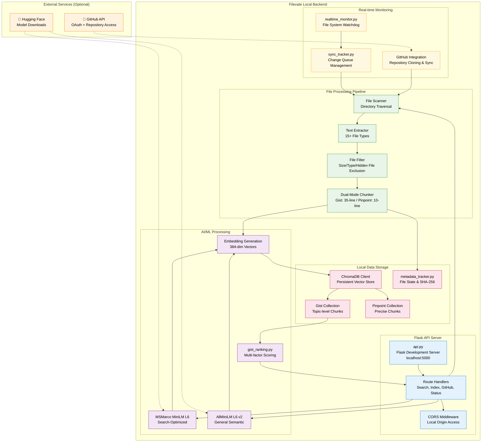

# Filevate Backend Architecture

**Local AI-Powered Semantic Search Platform - Backend Systems**

## System Overview

This diagram illustrates the backend architecture of Filevate, showcasing the dual-model AI architecture, GitHub integration, and local-first processing design.

## Key Components

### **Flask API Server (api.py)**
- **Local Development Server**: Runs on localhost:5000
- **RESTful Endpoints**: Search, indexing, GitHub integration, status
- **CORS Enabled**: Accepts requests from Electron desktop app
- **No Authentication**: Local-only access for single-user desktop app

### **Dual-Model AI Architecture**
- **Gist Model**: MSMarco MiniLM L6 CoS v5 for search-optimized tasks
- **Pinpoint Model**: AllMiniLM L6 v2 for general semantic understanding
- **Local Processing**: All AI inference happens on user's machine
- **Offline Capable**: No external API calls for search operations

### **ChromaDB Vector Storage**
- **Persistent Client**: Local database with automatic persistence
- **Dual Collections**: Separate storage for Gist and Pinpoint chunks
- **HNSW Indexing**: Efficient vector similarity search
- **Metadata Integration**: File paths, timestamps, and chunk information

### **Real-time File Monitoring**
- **Watchdog Integration**: Cross-platform file system monitoring
- **Change Detection**: SHA-256 hashing for efficient change identification
- **Queue Management**: Background processing of file changes
- **GitHub Sync**: Repository change detection and incremental updates

### **GitHub Integration**
- **OAuth Device Flow**: Industry-standard authentication
- **Repository Cloning**: Local copies for offline indexing
- **Branch Management**: Track multiple branches with intelligent switching
- **Secure Token Storage**: System keyring integration

## Performance Characteristics

### **Processing Capabilities**
- **File Processing**: 50-100 files per minute (varies by size)
- **Search Response**: Typically 100-300ms for local queries
- **Concurrent Operations**: Search while indexing supported
- **Memory Usage**: 2-4GB depending on collection size

### **Scalability Limits**
- **Collection Size**: Tested with up to 100K documents
- **File Size Limit**: Configurable (default 100MB)
- **Concurrent Users**: Single-user desktop application
- **Network Dependencies**: GitHub and model downloads only

## Security Model

### **Local-First Security**
- **No External Data Transmission**: Document content stays local
- **OS-Level Permissions**: Standard user account security
- **Keyring Integration**: Secure GitHub token storage
- **CORS Protection**: API restricted to desktop app origin

### **GitHub Security**
- **Read-Only Access**: No repository modification permissions
- **OAuth Tokens**: Secure storage and automatic refresh
- **Repository Isolation**: Each repo cloned to separate directory
- **Revocation Support**: Easy token removal via GitHub settings

---

*This backend architecture diagram reflects the current local-first implementation of Filevate's semantic search platform.*