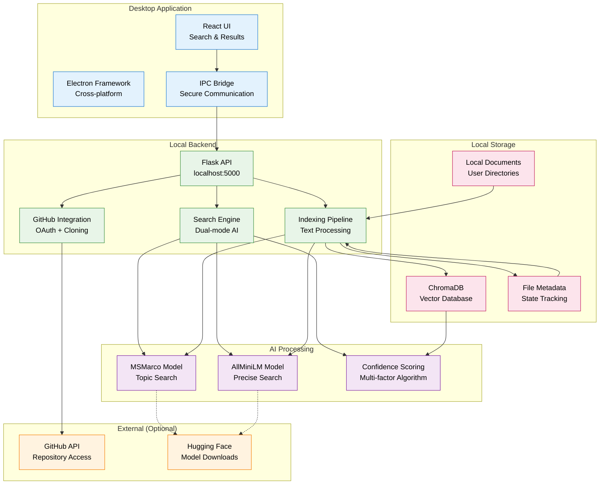

# Filevate System Architecture

**AI-Powered Local Semantic Search Platform**

## High-Level System Overview

This diagram shows the complete Filevate system design, including desktop frontend, AI backend, and local data storage.

## Core Architecture

### **Local-First Design**
- All document processing happens locally
- No cloud dependencies for core functionality
- Complete user data ownership and privacy

### **Dual-Model AI**
- MSMarco MiniLM for search-optimized tasks
- AllMiniLM for general semantic understanding
- Confidence scoring for result ranking

### **Desktop Application**
- Electron + React cross-platform interface
- Secure IPC communication with backend
- Real-time search and indexing feedback

### **Vector Storage**
- ChromaDB for efficient similarity search
- Persistent metadata for file state tracking
- Local storage in platform-appropriate directories

## Key Features

### **Search Capabilities**
- Natural language query understanding
- Dual search modes (Gist/Pinpoint)
- Multi-factor confidence scoring
- Real-time result ranking

### **File Processing**
- 15+ file type support
- Intelligent text extraction
- Dual-chunking strategy
- Real-time change detection

### **GitHub Integration**
- OAuth device flow authentication
- Repository cloning and sync
- Branch-aware indexing
- Offline search of repositories

---

*This diagram reflects the current local-first implementation of Filevate.*
