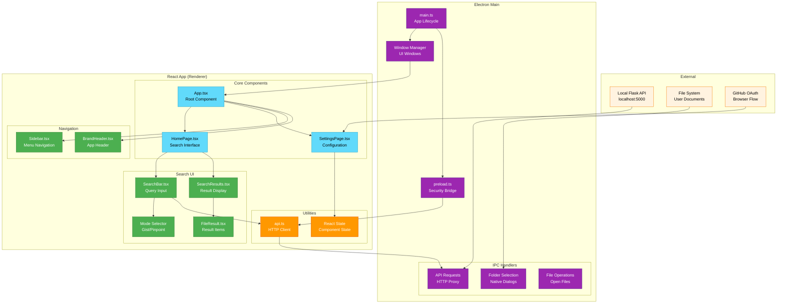

# Filevate Frontend Architecture

**Desktop Application - Electron + React + TypeScript**

## System Overview

Frontend architecture of the Filevate desktop application with React UI and Electron framework.

## Key Components

### **Electron Framework**
- **Main Process**: Application lifecycle and window management
- **Preload Script**: Secure bridge between main and renderer
- **IPC Handlers**: Communication with Flask backend
- **Native Integration**: File dialogs and system access

### **React Application**
- **Component Architecture**: Modular UI components
- **Search Interface**: Query input and result display
- **Settings Management**: Configuration and GitHub setup
- **State Management**: React hooks for data flow

### **Communication Flow**
- **User Input**: React components capture user interactions
- **IPC Bridge**: Secure communication to main process
- **API Proxy**: Main process forwards requests to Flask
- **Result Display**: Search results rendered in React UI

## Technology Stack

### **Frontend**
- **Electron**: Cross-platform desktop framework
- **React**: UI component library
- **TypeScript**: Type-safe development
- **CSS**: Modern responsive styling

### **Development**
- **Webpack**: Module bundling
- **Node.js**: JavaScript runtime
- **npm**: Package management
- **Hot Reload**: Development efficiency

---

*This frontend architecture reflects the current Electron + React implementation.*
