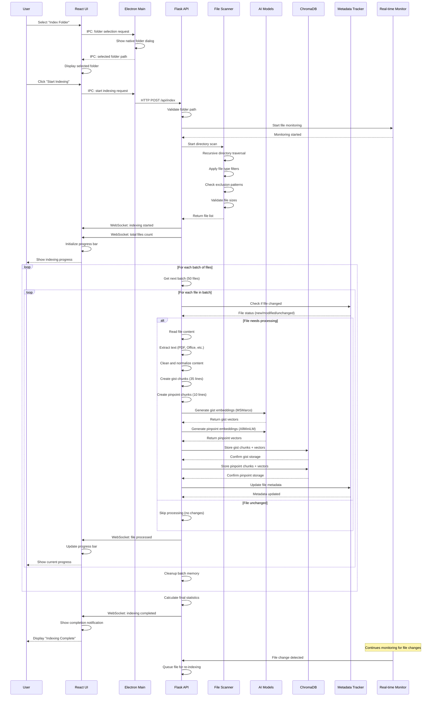
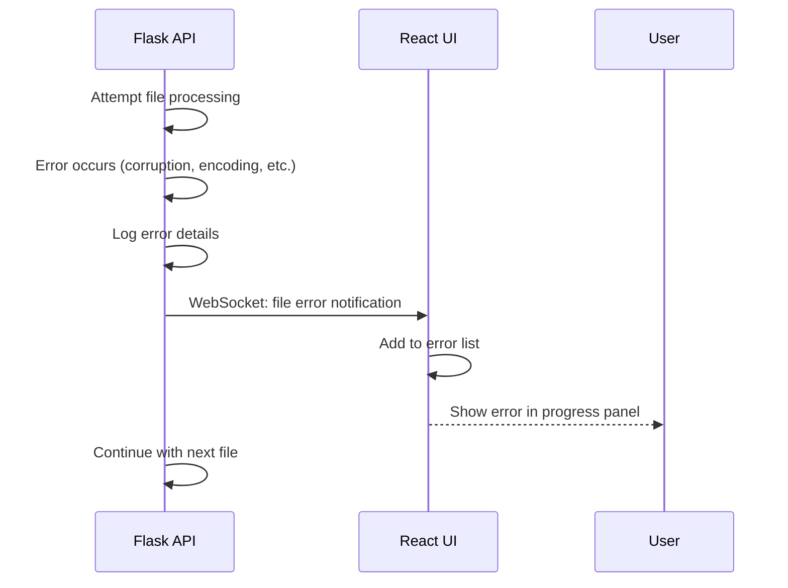
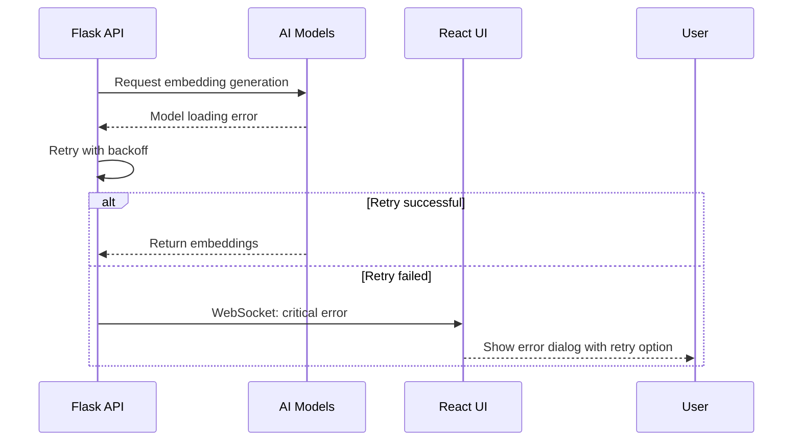

# Indexing Sequence Diagram

**End-to-End Document Indexing Process Flow**

## Overview

This sequence diagram illustrates the complete document indexing workflow in Filevate, from user initiation to completion notification.

## Sequence Details

### **1. User Initiation Phase**
- User selects folder through native dialog
- Indexing request sent to Flask backend
- Initial validation and setup

### **2. File Discovery Phase**
- Recursive directory scanning
- File type and size filtering
- Exclusion pattern application
- Total file count determination

### **3. Progress Initialization Phase**
- Real-time monitoring setup
- Progress tracking initialization
- User interface updates begin

### **4. Batch Processing Phase**
- Files processed in configurable batches (default: 50)
- Change detection using SHA-256 hashing
- Skip unchanged files for efficiency

### **5. Content Processing Phase**
- Multi-format text extraction
- Content cleaning and normalization
- Dual-mode chunking (gist + pinpoint)

### **6. AI Processing Phase**
- Embedding generation using appropriate models
- Vector computation (384 dimensions)
- Local AI inference (no external calls)

### **7. Storage Phase**
- Vector storage in ChromaDB collections
- Metadata tracking for change detection
- Persistent storage with automatic backup

### **8. Progress Tracking Phase**
- Real-time WebSocket updates to UI
- Progress bar and status updates
- Error notification and handling

### **9. Completion Phase**
- Final statistics calculation
- Completion notification to user
- Real-time monitoring activation

## Error Handling Scenarios

### **File Processing Errors**

### **Model Loading Errors**

## Performance Optimizations

### **Batch Processing**
- **Configurable Batch Size**: Balance memory vs. throughput
- **Memory Cleanup**: Regular cleanup between batches
- **Progress Granularity**: Efficient progress updates

### **Change Detection**
- **SHA-256 Hashing**: Fast content change detection
- **Metadata Tracking**: Skip unchanged files
- **Incremental Updates**: Only process modifications

### **Parallel Processing**
- **Multi-threading**: Configurable worker threads
- **AI Model Sharing**: Efficient model reuse
- **I/O Optimization**: Async file operations

### **Memory Management**
- **Streaming Processing**: Large files processed in chunks
- **Resource Limits**: Configurable memory limits
- **Garbage Collection**: Proactive memory cleanup

---

*This indexing sequence diagram shows the current document processing implementation in Filevate.*
