# Real-time Sync Flow

**File System Monitoring and Synchronization Workflow**

## Overview

This diagram illustrates the real-time file synchronization system in Filevate, showing how file changes are detected, queued, and processed automatically.

```mermaid
sequenceDiagram
    participant FileSystem as File System
    participant Watchdog as Watchdog Monitor
    participant EventHandler as Event Handler
    participant SyncTracker as Sync Tracker
    participant IndexingEngine as Indexing Engine
    participant ChromaDB as ChromaDB
    participant MetadataTracker as Metadata Tracker
    participant UI as User Interface

    %% Monitoring Setup
    Note over FileSystem,UI: Real-time Monitoring Initialization
    UI->>SyncTracker: Start real-time sync
    SyncTracker->>Watchdog: Initialize file monitoring
    Watchdog->>EventHandler: Register event callbacks
    EventHandler->>SyncTracker: Setup event processing
    SyncTracker-->>UI: Monitoring started

    %% File Change Detection
    Note over FileSystem,UI: File Change Detection Flow
    FileSystem->>Watchdog: File modified event
    Watchdog->>EventHandler: Process file event
    EventHandler->>EventHandler: Debounce rapid changes (500ms)
    EventHandler->>EventHandler: Filter system/temp files
    EventHandler->>EventHandler: Validate file type & size
    
    EventHandler->>SyncTracker: Queue file for processing
    SyncTracker->>SyncTracker: Add to change queue
    SyncTracker->>MetadataTracker: Check if file actually changed
    MetadataTracker-->>SyncTracker: File change status
    
    alt File Actually Changed
        SyncTracker->>SyncTracker: Confirm file needs reindexing
        SyncTracker->>UI: Update sync status (pending)
    else File Unchanged
        SyncTracker->>SyncTracker: Skip processing (no change)
    end

    %% Batch Processing
    Note over FileSystem,UI: Batch Processing Workflow
    loop Every 5 seconds or when queue reaches batch size
        SyncTracker->>SyncTracker: Get next batch from queue
        SyncTracker->>IndexingEngine: Process batch of changed files
        
        loop For each file in batch
            IndexingEngine->>IndexingEngine: Read file content
            IndexingEngine->>IndexingEngine: Extract text
            IndexingEngine->>IndexingEngine: Generate chunks
            IndexingEngine->>IndexingEngine: Create embeddings
            IndexingEngine->>ChromaDB: Update vector storage
            ChromaDB-->>IndexingEngine: Confirm storage
            IndexingEngine->>MetadataTracker: Update file metadata
            MetadataTracker-->>IndexingEngine: Metadata updated
        end
        
        IndexingEngine-->>SyncTracker: Batch processing complete
        SyncTracker->>UI: Update sync status (processed)
    end

    %% GitHub Repository Sync
    Note over FileSystem,UI: GitHub Repository Sync Flow
    loop Every 30 minutes
        SyncTracker->>SyncTracker: Check GitHub repositories
        SyncTracker->>SyncTracker: Perform git pull
        
        alt Repository Updated
            SyncTracker->>SyncTracker: Compare branch manifests
            SyncTracker->>SyncTracker: Identify changed files
            SyncTracker->>SyncTracker: Queue changed files
            SyncTracker->>IndexingEngine: Process GitHub changes
            IndexingEngine-->>SyncTracker: GitHub sync complete
            SyncTracker->>UI: Show sync notification
        else No Changes
            SyncTracker->>SyncTracker: No action needed
        end
    end

    %% Error Handling
    Note over FileSystem,UI: Error Handling Flow
    alt File Processing Error
        IndexingEngine-->>SyncTracker: Processing error
        SyncTracker->>SyncTracker: Log error details
        SyncTracker->>SyncTracker: Retry with backoff
        
        alt Retry Successful
            IndexingEngine-->>SyncTracker: Retry succeeded
            SyncTracker->>UI: Update status (success)
        else Retry Failed
            SyncTracker->>SyncTracker: Move to failed queue
            SyncTracker->>UI: Show error notification
        end
    else File Access Error
        Watchdog-->>EventHandler: File access denied
        EventHandler->>SyncTracker: Skip inaccessible file
        SyncTracker->>UI: Log warning (file skipped)
    else Disk Space Error
        IndexingEngine-->>SyncTracker: Disk space insufficient
        SyncTracker->>SyncTracker: Pause sync operations
        SyncTracker->>UI: Show disk space warning
    end

    %% User Interactions
    Note over FileSystem,UI: User Interaction Flow
    alt User Pauses Sync
        UI->>SyncTracker: Pause real-time sync
        SyncTracker->>Watchdog: Stop file monitoring
        SyncTracker->>UI: Sync paused confirmation
    else User Resumes Sync
        UI->>SyncTracker: Resume real-time sync
        SyncTracker->>Watchdog: Restart file monitoring
        SyncTracker->>UI: Sync resumed confirmation
    else User Views Sync Status
        UI->>SyncTracker: Request sync status
        SyncTracker-->>UI: Return current status
        UI->>UI: Display sync statistics
    end

    %% Manual Sync Trigger
    Note over FileSystem,UI: Manual Sync Operations
    alt User Triggers Manual Sync
        UI->>SyncTracker: Force sync all files
        SyncTracker->>MetadataTracker: Get all tracked files
        MetadataTracker-->>SyncTracker: Return file list
        SyncTracker->>SyncTracker: Queue all files for check
        SyncTracker->>IndexingEngine: Process full sync
        IndexingEngine-->>SyncTracker: Full sync complete
        SyncTracker->>UI: Show completion notification
    else User Resets Sync State
        UI->>SyncTracker: Reset sync state
        SyncTracker->>SyncTracker: Clear all queues
        SyncTracker->>MetadataTracker: Reset file states
        MetadataTracker-->>SyncTracker: State reset
        SyncTracker->>UI: Reset confirmation
    end
```

## Sync Components

### **1. File System Monitoring**
- **Watchdog Integration**: Cross-platform file system event monitoring
- **Event Filtering**: Skip system files, temporary files, and build artifacts
- **Debouncing**: Combine rapid successive changes into single events
- **Path Normalization**: Handle different path formats across platforms

### **2. Change Detection**
- **SHA-256 Hashing**: Detect actual content changes vs. metadata changes
- **Timestamp Validation**: Use modification times for quick change detection
- **Size Comparison**: Detect file size changes for efficient filtering
- **Metadata Tracking**: Maintain persistent state of all indexed files

### **3. Queue Management**
- **Priority Queuing**: Process user-modified files before background changes
- **Batch Processing**: Group changes for efficient processing
- **Rate Limiting**: Prevent system overload during mass file operations
- **Error Recovery**: Retry failed operations with exponential backoff

### **4. Incremental Processing**
- **Content-Based Updates**: Only reprocess files with actual content changes
- **Chunk-Level Updates**: Update specific chunks rather than entire files
- **Vector Updates**: Efficiently update ChromaDB without full reindexing
- **Metadata Sync**: Keep file metadata in sync with vector storage

### **5. GitHub Repository Sync**
- **Periodic Pulls**: Scheduled git pull operations for remote changes
- **Branch Awareness**: Monitor multiple branches independently
- **Manifest Comparison**: Compare current state with last known state
- **Conflict Resolution**: Handle divergent local and remote changes

## Performance Characteristics

### **Monitoring Efficiency**
- **Low CPU Overhead**: Minimal impact on system performance
- **Memory Efficient**: Bounded memory usage even with large directories
- **Selective Monitoring**: Only monitor indexed directories
- **Intelligent Filtering**: Skip irrelevant files at the OS level

### **Processing Optimization**
- **Batch Size Tuning**: Configurable batch sizes for different workloads
- **Parallel Processing**: Multi-threaded file processing within batches
- **Memory Management**: Efficient memory usage for large file operations
- **Cache Utilization**: Reuse embeddings and metadata where possible

### **Real-time Responsiveness**
- **Sub-Second Detection**: File changes detected within 100-500ms
- **Prioritized Processing**: User-modified files processed first
- **Progress Feedback**: Real-time status updates to user interface
- **Background Operations**: Non-blocking sync operations

## Error Handling Strategies

### **Transient Errors**
- **Network Issues**: Retry with exponential backoff for GitHub operations
- **File Locks**: Wait and retry for files locked by other processes
- **Memory Pressure**: Reduce batch sizes when memory is constrained
- **Disk Space**: Pause operations when disk space is low

### **Permanent Errors**
- **File Permissions**: Skip files with insufficient permissions
- **Corrupted Files**: Log and skip files that cannot be processed
- **Model Errors**: Fallback to basic indexing when AI models fail
- **Database Errors**: Rebuild indices when database corruption is detected

### **User Communication**
- **Status Indicators**: Clear visual feedback on sync status
- **Error Notifications**: User-friendly error messages with suggested actions
- **Progress Tracking**: Real-time progress for batch operations
- **Sync Statistics**: Historical sync performance and error rates

## Configuration Options

### **Monitoring Settings**
- **Watch Directories**: User-configurable list of monitored directories
- **Exclusion Patterns**: Customizable patterns for files to ignore
- **Debounce Timing**: Adjustable delay for rapid change consolidation
- **Batch Size**: Configurable number of files per processing batch

### **Performance Tuning**
- **Worker Threads**: Number of parallel processing threads
- **Memory Limits**: Maximum memory usage for sync operations
- **Queue Limits**: Maximum number of queued changes
- **Sync Frequency**: Interval for GitHub repository sync checks

### **User Preferences**
- **Auto-Sync**: Enable/disable automatic file monitoring
- **Notification Level**: Control verbosity of sync notifications
- **Background Mode**: Continue sync when application is minimized
- **Startup Behavior**: Automatically start sync on application launch

---

*This real-time sync flow ensures that Filevate maintains an up-to-date search index with minimal user intervention and optimal system performance.*
