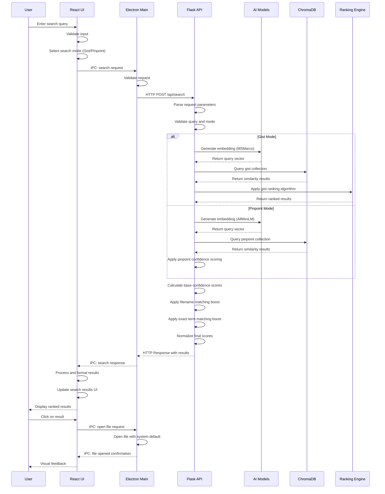

# Search Sequence Diagram

**End-to-End Search Process Flow**

## Overview

This sequence diagram shows the complete interaction flow for a search operation in Filevate, from user input to result display.

## Sequence Details

### **1. User Input Phase**
- User enters natural language query in search bar
- React UI validates input and selects search mode
- Query preprocessing (normalization, validation)

### **2. Request Routing Phase**
- React UI sends request via Electron IPC
- Main process validates and forwards to Flask API
- Security validation and parameter checking

### **3. AI Processing Phase**
- Flask API selects appropriate AI model
- Query converted to 384-dimensional vector
- Model inference performed locally

### **4. Vector Search Phase**
- ChromaDB performs cosine similarity search
- Retrieves top-k most similar chunks
- Raw distance scores returned

### **5. Ranking Phase**
- **Gist Mode**: Multi-factor ranking algorithm applied
- **Pinpoint Mode**: Direct confidence score calculation
- Boosting factors applied (filename, exact terms)

### **6. Response Phase**
- Results formatted with confidence scores
- Response sent back through Electron IPC
- React UI updates with ranked results

### **7. User Interaction Phase**
- User can click on results to open files
- System file manager opens selected documents
- Visual feedback provided to user

## Performance Considerations

### **Response Time Optimization**
- **Local Processing**: All operations on user's machine
- **Model Caching**: AI models loaded once at startup
- **Vector Index**: ChromaDB provides fast similarity search
- **Efficient IPC**: Minimal overhead between components

### **Error Handling**
- **Input Validation**: Malformed queries handled gracefully
- **Model Failures**: Fallback error messages for AI issues
- **Database Errors**: Recovery and user notification
- **Network Timeouts**: Graceful timeout handling

### **Memory Management**
- **Batch Processing**: Large result sets processed in chunks
- **Resource Cleanup**: Proper cleanup after operations
- **Memory Limits**: Configurable limits for large operations

---

*This sequence diagram shows the current search implementation flow in Filevate.*
