# UI Interaction Flow

**Complete User Interface Interaction and State Management Flow**

## Overview

This diagram shows the comprehensive user interface interaction flow in Filevate, from user actions through state management to backend API communication.

```mermaid
sequenceDiagram
    participant User
    participant React_Components as React Components
    participant App_State as App State
    participant Electron_IPC as Electron IPC
    participant Main_Process as Main Process
    participant Flask_API as Flask API
    participant AI_Backend as AI Backend

    %% Application Startup
    Note over User,AI_Backend: Application Startup Flow
    User->>Main_Process: Launch Filevate
    Main_Process->>Flask_API: Start Python backend
    Flask_API->>AI_Backend: Initialize AI models
    AI_Backend-->>Flask_API: Models loaded
    Flask_API-->>Main_Process: API server ready
    Main_Process->>React_Components: Create window & load UI
    React_Components->>App_State: Initialize application state
    App_State-->>React_Components: State initialized
    React_Components-->>User: Show application interface

    %% Search Interaction Flow
    Note over User,AI_Backend: Search Interaction Flow
    User->>React_Components: Enter search query
    React_Components->>App_State: Update query state
    React_Components->>React_Components: Validate input
    User->>React_Components: Select search mode (Gist/Pinpoint)
    React_Components->>App_State: Update mode state
    User->>React_Components: Apply filters (optional)
    React_Components->>App_State: Update filter state
    
    User->>React_Components: Submit search
    React_Components->>App_State: Set loading state
    React_Components->>Electron_IPC: Send search request
    Electron_IPC->>Main_Process: Forward search request
    Main_Process->>Flask_API: HTTP POST /api/search
    Flask_API->>AI_Backend: Process query with AI
    AI_Backend-->>Flask_API: Return ranked results
    Flask_API-->>Main_Process: HTTP response with results
    Main_Process-->>Electron_IPC: Forward results
    Electron_IPC-->>React_Components: Receive search results
    React_Components->>App_State: Update results state
    React_Components-->>User: Display search results

    %% File Interaction Flow
    Note over User,AI_Backend: File Interaction Flow
    User->>React_Components: Click on search result
    React_Components->>Electron_IPC: Request file open
    Electron_IPC->>Main_Process: Handle file open request
    Main_Process->>Main_Process: Open file with system default
    Main_Process-->>Electron_IPC: File open confirmation
    Electron_IPC-->>React_Components: Update UI feedback
    React_Components-->>User: Show file opened feedback

    %% Folder Indexing Flow
    Note over User,AI_Backend: Folder Indexing Flow
    User->>React_Components: Click "Index Folder"
    React_Components->>Electron_IPC: Request folder selection
    Electron_IPC->>Main_Process: Show native folder dialog
    Main_Process-->>Electron_IPC: Return selected folder
    Electron_IPC-->>React_Components: Folder path received
    React_Components->>App_State: Update folder state
    
    User->>React_Components: Start indexing
    React_Components->>App_State: Set indexing state
    React_Components->>Electron_IPC: Send indexing request
    Electron_IPC->>Main_Process: Forward indexing request
    Main_Process->>Flask_API: HTTP POST /api/index
    Flask_API->>AI_Backend: Start background indexing
    
    loop Real-time Progress Updates
        AI_Backend->>Flask_API: Progress update
        Flask_API->>Main_Process: WebSocket progress event
        Main_Process->>Electron_IPC: Forward progress
        Electron_IPC->>React_Components: Update progress
        React_Components->>App_State: Update progress state
        React_Components-->>User: Show progress bar
    end
    
    AI_Backend-->>Flask_API: Indexing complete
    Flask_API-->>Main_Process: Completion notification
    Main_Process-->>Electron_IPC: Indexing done
    Electron_IPC-->>React_Components: Completion received
    React_Components->>App_State: Set completion state
    React_Components-->>User: Show completion notification

    %% GitHub Integration Flow
    Note over User,AI_Backend: GitHub Integration Flow
    User->>React_Components: Navigate to GitHub page
    React_Components->>App_State: Update route state
    User->>React_Components: Click "Connect GitHub"
    React_Components->>Electron_IPC: Start GitHub OAuth
    Electron_IPC->>Main_Process: Handle OAuth initiation
    Main_Process->>Flask_API: POST /api/github/auth/start
    Flask_API-->>Main_Process: Device code & verification URL
    Main_Process-->>Electron_IPC: OAuth details
    Electron_IPC-->>React_Components: Show device code
    React_Components-->>User: Display code & URL
    
    User->>User: Complete OAuth in browser
    
    loop OAuth Polling
        React_Components->>Electron_IPC: Poll for token
        Electron_IPC->>Main_Process: Check OAuth status
        Main_Process->>Flask_API: POST /api/github/auth/poll
        Flask_API-->>Main_Process: OAuth status
        Main_Process-->>Electron_IPC: Status update
        Electron_IPC-->>React_Components: Update status
    end
    
    Flask_API-->>Main_Process: OAuth complete + token
    Main_Process-->>Electron_IPC: Authentication success
    Electron_IPC-->>React_Components: GitHub connected
    React_Components->>App_State: Update GitHub state
    React_Components-->>User: Show connected status

    %% Settings Management Flow
    Note over User,AI_Backend: Settings Management Flow
    User->>React_Components: Navigate to Settings
    React_Components->>App_State: Update route state
    React_Components->>Electron_IPC: Load current settings
    Electron_IPC->>Main_Process: Get configuration
    Main_Process->>Flask_API: GET /api/config
    Flask_API-->>Main_Process: Current configuration
    Main_Process-->>Electron_IPC: Settings data
    Electron_IPC-->>React_Components: Receive settings
    React_Components->>App_State: Update settings state
    React_Components-->>User: Display settings interface
    
    User->>React_Components: Modify settings
    React_Components->>App_State: Update settings state
    User->>React_Components: Save settings
    React_Components->>Electron_IPC: Send updated settings
    Electron_IPC->>Main_Process: Forward settings
    Main_Process->>Flask_API: POST /api/config
    Flask_API-->>Main_Process: Settings saved
    Main_Process-->>Electron_IPC: Save confirmation
    Electron_IPC-->>React_Components: Settings updated
    React_Components->>App_State: Confirm settings state
    React_Components-->>User: Show save confirmation

    %% Error Handling Flow
    Note over User,AI_Backend: Error Handling Flow
    alt API Error Occurs
        Flask_API-->>Main_Process: HTTP error response
        Main_Process-->>Electron_IPC: Error details
        Electron_IPC-->>React_Components: Error received
        React_Components->>App_State: Set error state
        React_Components-->>User: Display error notification
        User->>React_Components: Retry action
        React_Components->>App_State: Clear error state
        React_Components->>Electron_IPC: Retry request
    else Network Error
        Electron_IPC-->>React_Components: Network timeout
        React_Components->>App_State: Set offline state
        React_Components-->>User: Show offline indicator
    else Model Loading Error
        AI_Backend-->>Flask_API: Model load failure
        Flask_API-->>Main_Process: Critical error
        Main_Process-->>Electron_IPC: Show error dialog
        Electron_IPC-->>React_Components: Critical error
        React_Components-->>User: Show restart prompt
    end
```

## Interaction Patterns

### **1. State Management Pattern**
- **Centralized State**: App-level state management using React hooks
- **Local Component State**: UI-specific state in individual components
- **State Synchronization**: Real-time updates between backend and frontend
- **Persistent State**: Settings and preferences stored locally

### **2. Communication Pattern**
- **IPC Bridge**: Secure communication via Electron preload script
- **Request-Response**: Synchronous API calls for immediate operations
- **Event Streaming**: Real-time updates for long-running operations
- **Error Propagation**: Consistent error handling across layers

### **3. User Feedback Pattern**
- **Immediate Feedback**: Instant UI responses to user actions
- **Progress Indication**: Real-time progress for background operations
- **Status Updates**: Clear status messages and notifications
- **Error Recovery**: Graceful error handling with retry options

### **4. Navigation Pattern**
- **Route Management**: Client-side routing between application pages
- **State Preservation**: Maintain search results across navigation
- **Deep Linking**: Support for direct navigation to specific features
- **Breadcrumb Navigation**: Clear path indication for user orientation

## Component Interactions

### **Core UI Components**
- **SearchBar**: Query input with mode selection and validation
- **SearchResults**: Result display with confidence scores and actions
- **Sidebar**: Navigation and application state overview
- **StatusBar**: Real-time status and operation feedback
- **ProgressBar**: Visual feedback for long-running operations

### **Page Components**
- **HomePage**: Main search interface and result display
- **SettingsPage**: Configuration and preferences management
- **GitHubPage**: Repository connection and management
- **TrackFilesPage**: File indexing status and management
- **SavedPage**: Saved searches and bookmarks

### **Modal Components**
- **IndexingModal**: Folder selection and indexing configuration
- **ErrorModal**: Error display and recovery options
- **ConfirmModal**: User confirmation for destructive actions
- **LoadingModal**: Model loading and initialization feedback

## State Flow Patterns

### **Search State Flow**
1. **Query Entry**: User types in search bar → Update query state
2. **Mode Selection**: User selects mode → Update mode state
3. **Filter Application**: User applies filters → Update filter state
4. **Search Execution**: User submits → Set loading → Call API → Update results
5. **Result Interaction**: User clicks result → Open file → Update feedback

### **Indexing State Flow**
1. **Folder Selection**: User selects folder → Update folder state
2. **Configuration**: User sets options → Update indexing config
3. **Initiation**: User starts indexing → Set indexing state → Start progress
4. **Progress Updates**: Real-time progress → Update progress state → Update UI
5. **Completion**: Indexing done → Update completion state → Show notification

### **GitHub State Flow**
1. **Connection**: User connects GitHub → Start OAuth → Show device code
2. **Authorization**: User authorizes → Poll for token → Update auth state
3. **Repository List**: Fetch repos → Update repo state → Display list
4. **Repository Selection**: User selects repo → Clone → Start indexing
5. **Sync Status**: Monitor sync → Update sync state → Show status

## Performance Optimizations

### **UI Responsiveness**
- **Debounced Inputs**: Prevent excessive API calls from rapid typing
- **Virtual Scrolling**: Efficient rendering of large result lists
- **Lazy Loading**: Load components and data on demand
- **Memoization**: Cache expensive computations and renders

### **State Management**
- **Selective Updates**: Only update changed state portions
- **State Normalization**: Efficient state structure for complex data
- **Optimistic Updates**: Immediate UI feedback before API confirmation
- **Error Boundaries**: Prevent errors from crashing entire application

### **Memory Management**
- **Component Cleanup**: Proper cleanup of event listeners and timers
- **State Cleanup**: Clear unused state to prevent memory leaks
- **Image Optimization**: Efficient loading and caching of UI assets
- **Garbage Collection**: Proper object lifecycle management

---

*This UI interaction flow diagram shows the complete user experience and state management architecture in Filevate's desktop application.*
