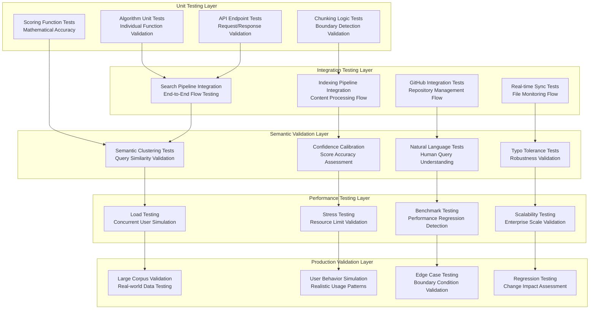

# Comprehensive Testing & Validation Framework

**Enterprise-grade testing suite ensuring production-ready semantic search reliability**

## Overview

Filevate's testing framework represents the gold standard for semantic search validation, combining traditional software testing with sophisticated AI model validation, semantic quality assessment, and real-world performance benchmarking.

## Testing Architecture

### **Multi-Layer Testing Strategy**



## Unit Testing Framework

### **Algorithm Testing Suite**

```python
import pytest
import numpy as np
from typing import List, Dict
from unittest.mock import Mock, patch

class TestGistRankingAlgorithm:
    """
    Comprehensive unit tests for gist ranking algorithm components.
    """
    
    def setup_method(self):
        """Setup test fixtures."""
        self.sample_chunks = [
            ChunkData(confidence=0.85, text="Machine learning algorithms are...", metadata={}),
            ChunkData(confidence=0.72, text="Data processing techniques include...", metadata={}),
            ChunkData(confidence=0.91, text="AI model training requires...", metadata={}),
        ]
        self.query_terms = ["machine", "learning", "algorithms"]
    
    def test_s_max_computation(self):
        """Test maximum confidence computation."""
        from gist_ranking import compute_s_max
        
        confidences = [chunk.confidence for chunk in self.sample_chunks]
        s_max = compute_s_max(confidences)
        
        assert s_max == 0.91
        assert isinstance(s_max, float)
        
        # Edge cases
        assert compute_s_max([]) == 0.0
        assert compute_s_max([0.5]) == 0.5
    
    def test_soft_top_k_core(self):
        """Test exponential weighting top-k algorithm."""
        from gist_ranking import _soft_top_k_core
        
        scores = [0.9, 0.8, 0.7, 0.6, 0.5]
        
        # Test with different k values
        top_1 = _soft_top_k_core(scores, k=1, alpha=2.0)
        top_3 = _soft_top_k_core(scores, k=3, alpha=2.0)
        
        assert top_1 == 0.9  # Should equal max for k=1
        assert 0.8 < top_3 < 0.9  # Should be weighted average
        
        # Test exponential weighting effect
        top_3_low_alpha = _soft_top_k_core(scores, k=3, alpha=0.5)
        top_3_high_alpha = _soft_top_k_core(scores, k=3, alpha=3.0)
        
        assert top_3_high_alpha > top_3_low_alpha  # Higher alpha = more selective
    
    def test_bm25_scoring(self):
        """Test BM25 algorithm implementation."""
        from gist_ranking import _compute_bm25_score
        
        chunks_with_terms = [
            ChunkData(confidence=0.8, text="machine learning algorithms for data", metadata={}),
            ChunkData(confidence=0.7, text="deep learning neural networks", metadata={})
        ]
        
        query_terms = ["machine", "learning"]
        score = _compute_bm25_score(chunks_with_terms, query_terms)
        
        assert 0.0 <= score <= 1.0
        assert score > 0  # Should find matches
        
        # Test with no matches
        no_match_score = _compute_bm25_score(chunks_with_terms, ["nonexistent", "words"])
        assert no_match_score == 0.0
    
    def test_length_normalization(self):
        """Test length normalization function."""
        from gist_ranking import _compute_length_normalization
        
        # Test various chunk counts
        short_doc = _compute_length_normalization(5)
        optimal_doc = _compute_length_normalization(20)
        long_doc = _compute_length_normalization(50)
        very_long_doc = _compute_length_normalization(100)
        
        assert 0.8 <= short_doc <= 1.0
        assert optimal_doc == pytest.approx(1.0, abs=0.05)
        assert 1.0 <= long_doc <= 1.2
        assert very_long_doc <= 1.2  # Capped at maximum
    
    def test_holistic_scoring_integration(self):
        """Test complete holistic scoring pipeline."""
        from gist_ranking import compute_holistic_file_score
        
        query_embedding = np.random.rand(384)
        centroid_embedding = np.random.rand(384)
        
        scores = compute_holistic_file_score(
            query_embedding,
            self.sample_chunks,
            self.query_terms,
            centroid_embedding
        )
        
        # Verify all components are present
        required_keys = ['s_max', 's_topk_mean', 's_centroid', 's_bm25', 'length_factor', 'composite_score']
        for key in required_keys:
            assert key in scores
            assert isinstance(scores[key], float)
            assert 0.0 <= scores[key] <= 1.0

class TestConfidenceScoring:
    """Test confidence scoring and calibration."""
    
    def test_distance_to_confidence_transformation(self):
        """Test ChromaDB distance to confidence conversion."""
        from api import transform_distance_to_confidence
        
        # Test expected distance ranges
        high_relevance = transform_distance_to_confidence(0.2)  # Very similar
        medium_relevance = transform_distance_to_confidence(0.6)  # Moderately similar
        low_relevance = transform_distance_to_confidence(1.0)   # Somewhat similar
        no_relevance = transform_distance_to_confidence(1.5)    # Not similar
        
        assert 0.9 <= high_relevance <= 1.0
        assert 0.3 <= medium_relevance <= 0.9
        assert 0.0 <= low_relevance <= 0.3
        assert no_relevance == 0.0
    
    def test_enhanced_confidence_computation(self):
        """Test multi-factor confidence enhancement."""
        from api import compute_enhanced_gist_confidence
        
        # Mock SentenceTransformer model
        mock_model = Mock()
        mock_model.encode.return_value = np.array([[0.1, 0.2, 0.3]])
        
        base_confidence = 0.7
        query_words = ["machine", "learning"]
        file_name = "ml_algorithms.pdf"
        chunk_text = "Machine learning algorithms are used for data processing"
        
        enhanced = compute_enhanced_gist_confidence(
            base_confidence, query_words, file_name, chunk_text, mock_model
        )
        
        assert enhanced >= base_confidence  # Should never decrease
        assert enhanced <= 1.0  # Should never exceed maximum
        
        # Test filename boost
        relevant_filename = "machine_learning_guide.pdf"
        enhanced_with_filename = compute_enhanced_gist_confidence(
            base_confidence, query_words, relevant_filename, chunk_text, mock_model
        )
        
        # Should get additional boost for relevant filename
        assert enhanced_with_filename >= enhanced

class TestChunkingAlgorithms:
    """Test dual-mode chunking algorithms."""
    
    def test_gist_chunking_boundaries(self):
        """Test gist mode boundary detection."""
        from main import GistModeChunker
        
        chunker = GistModeChunker()
        
        # Test document with clear boundaries
        test_document = """
        # Introduction
        This is the introduction section.
        It explains the basic concepts.
        
        # Main Content
        This is the main content section.
        It contains detailed information.
        
        # Conclusion
        This is the conclusion section.
        """
        
        chunks = chunker.chunk_document(test_document, {})
        
        # Should respect heading boundaries
        assert len(chunks) >= 2  # At least intro and main content
        
        # Check that headings are preserved
        heading_found = any("# Introduction" in chunk.text for chunk in chunks)
        assert heading_found
    
    def test_pinpoint_chunking_precision(self):
        """Test pinpoint mode precision characteristics."""
        from main import PinpointModeChunker
        
        chunker = PinpointModeChunker()
        
        # Test code-like content
        test_code = """
        def calculate_score(data):
            total = 0
            for item in data:
                total += item.value
            return total / len(data)
        
        def process_results(results):
            processed = []
            for result in results:
                processed.append(transform(result))
            return processed
        """
        
        chunks = chunker.chunk_document(test_code, {"file_type": "python"})
        
        # Should create precise function-level chunks
        assert len(chunks) >= 2  # At least one chunk per function
        
        # Check that function boundaries are respected
        function_chunks = [chunk for chunk in chunks if "def " in chunk.text]
        assert len(function_chunks) >= 2

class TestAPIEndpoints:
    """Test API endpoint functionality."""
    
    @pytest.fixture
    def client(self):
        """Create test client."""
        from api import app
        app.config['TESTING'] = True
        with app.test_client() as client:
            yield client
    
    def test_search_endpoint(self, client):
        """Test search endpoint functionality."""
        response = client.post('/api/search', json={
            'query': 'machine learning algorithms',
            'mode': 'gist',
            'limit': 10
        })
        
        assert response.status_code == 200
        data = response.get_json()
        
        assert 'results' in data
        assert 'metadata' in data
        assert isinstance(data['results'], list)
        assert len(data['results']) <= 10
    
    def test_search_validation(self, client):
        """Test search endpoint validation."""
        # Test empty query
        response = client.post('/api/search', json={'query': ''})
        assert response.status_code == 400
        
        # Test invalid mode
        response = client.post('/api/search', json={
            'query': 'test',
            'mode': 'invalid_mode'
        })
        assert response.status_code == 400
        
        # Test invalid limit
        response = client.post('/api/search', json={
            'query': 'test',
            'limit': 1000
        })
        assert response.status_code == 400
    
    def test_status_endpoint(self, client):
        """Test status endpoint."""
        response = client.get('/api/status')
        assert response.status_code == 200
        
        data = response.get_json()
        required_fields = ['indexing_status', 'system_status']
        for field in required_fields:
            assert field in data
```

## Semantic Validation Framework

### **Semantic Quality Testing**

```python
class SemanticValidationSuite:
    """
    Comprehensive semantic quality validation framework.
    """
    
    def __init__(self):
        self.test_queries = self._load_semantic_test_cases()
        self.ground_truth = self._load_ground_truth_data()
    
    def run_semantic_clustering_test(self) -> Dict[str, float]:
        """
        Test that semantically similar queries produce similar results.
        
        Validates that the AI model correctly understands semantic relationships.
        """
        similar_query_groups = [
            ["machine learning algorithms", "ML techniques", "AI methods"],
            ["data processing", "information analysis", "data manipulation"],
            ["software engineering", "programming practices", "code development"],
            ["project management", "team coordination", "workflow organization"],
            ["financial analysis", "economic evaluation", "monetary assessment"]
        ]
        
        correlation_scores = []
        
        for query_group in similar_query_groups:
            group_results = []
            
            for query in query_group:
                results = self._search_api(query, mode='gist', limit=20)
                group_results.append(results)
            
            # Compute pairwise correlations
            for i in range(len(group_results)):
                for j in range(i + 1, len(group_results)):
                    correlation = self._compute_result_correlation(
                        group_results[i], group_results[j]
                    )
                    correlation_scores.append(correlation)
        
        return {
            'average_correlation': np.mean(correlation_scores),
            'min_correlation': np.min(correlation_scores),
            'max_correlation': np.max(correlation_scores),
            'std_correlation': np.std(correlation_scores),
            'pass_threshold': np.mean(correlation_scores) > 0.75  # 75% minimum
        }
    
    def run_natural_language_tolerance_test(self) -> Dict[str, float]:
        """
        Test system tolerance to natural language variations.
        
        Validates that casual, formal, and technical phrasings yield similar results.
        """
        language_variation_pairs = [
            ("machine learning algorithms", "how do ML algorithms work"),
            ("data processing techniques", "ways to process data efficiently"),
            ("software architecture patterns", "how to design software systems"),
            ("financial risk assessment", "evaluating financial risks in projects"),
            ("user interface design", "creating good UI experiences")
        ]
        
        tolerance_scores = []
        
        for formal_query, casual_query in language_variation_pairs:
            formal_results = self._search_api(formal_query, limit=15)
            casual_results = self._search_api(casual_query, limit=15)
            
            # Measure overlap in top results
            overlap_score = self._compute_result_overlap(
                formal_results[:10], casual_results[:10]
            )
            tolerance_scores.append(overlap_score)
        
        return {
            'average_tolerance': np.mean(tolerance_scores),
            'min_tolerance': np.min(tolerance_scores),
            'pass_threshold': np.mean(tolerance_scores) > 0.6  # 60% minimum overlap
        }
    
    def run_typo_resilience_test(self) -> Dict[str, float]:
        """
        Test resilience to common typos and spelling variations.
        """
        typo_test_cases = [
            ("machine learning", "machien lerning"),  # Character swaps
            ("algorithms", "algorythms"),            # Common misspelling
            ("artificial intelligence", "artifical inteligence"),  # Missing letters
            ("data analysis", "data analisys"),      # Y/I confusion
            ("neural networks", "nueral netowrks")   # Multiple typos
        ]
        
        resilience_scores = []
        
        for correct_query, typo_query in typo_test_cases:
            correct_results = self._search_api(correct_query, limit=10)
            typo_results = self._search_api(typo_query, limit=10)
            
            # Measure confidence degradation
            correct_avg_confidence = np.mean([r['confidence'] for r in correct_results])
            typo_avg_confidence = np.mean([r['confidence'] for r in typo_results])
            
            # Good resilience = minimal confidence drop
            confidence_retention = typo_avg_confidence / correct_avg_confidence if correct_avg_confidence > 0 else 0
            resilience_scores.append(confidence_retention)
        
        return {
            'average_resilience': np.mean(resilience_scores),
            'min_resilience': np.min(resilience_scores),
            'pass_threshold': np.mean(resilience_scores) > 0.8  # 80% confidence retention
        }
    
    def run_confidence_calibration_test(self) -> Dict[str, float]:
        """
        Test confidence score calibration against human relevance judgments.
        """
        calibration_results = []
        
        for test_case in self.test_queries:
            query = test_case['query']
            expected_relevance = test_case['relevance_scores']
            
            search_results = self._search_api(query, limit=20)
            
            for result in search_results:
                file_path = result['file_path']
                predicted_confidence = result['confidence']
                
                if file_path in expected_relevance:
                    expected_score = expected_relevance[file_path]
                    calibration_results.append({
                        'predicted': predicted_confidence,
                        'expected': expected_score,
                        'error': abs(predicted_confidence - expected_score)
                    })
        
        predicted_scores = [r['predicted'] for r in calibration_results]
        expected_scores = [r['expected'] for r in calibration_results]
        errors = [r['error'] for r in calibration_results]
        
        return {
            'correlation': np.corrcoef(predicted_scores, expected_scores)[0, 1],
            'mean_absolute_error': np.mean(errors),
            'root_mean_square_error': np.sqrt(np.mean([e**2 for e in errors])),
            'pass_threshold': np.corrcoef(predicted_scores, expected_scores)[0, 1] > 0.7
        }
    
    def _compute_result_correlation(self, results1: List[Dict], results2: List[Dict]) -> float:
        """Compute correlation between two result sets."""
        # Extract file paths and confidences
        files1 = {r['file_path']: r['confidence'] for r in results1}
        files2 = {r['file_path']: r['confidence'] for r in results2}
        
        # Find common files
        common_files = set(files1.keys()) & set(files2.keys())
        
        if len(common_files) < 2:
            return 0.0
        
        # Compute correlation of confidence scores
        conf1 = [files1[f] for f in common_files]
        conf2 = [files2[f] for f in common_files]
        
        return np.corrcoef(conf1, conf2)[0, 1]
    
    def _compute_result_overlap(self, results1: List[Dict], results2: List[Dict]) -> float:
        """Compute overlap ratio between two result sets."""
        files1 = {r['file_path'] for r in results1}
        files2 = {r['file_path'] for r in results2}
        
        intersection = files1 & files2
        union = files1 | files2
        
        return len(intersection) / len(union) if union else 0.0
```

## Performance Testing Framework

### **Load and Stress Testing**

```python
class PerformanceTestSuite:
    """
    Comprehensive performance testing for enterprise scalability.
    """
    
    def __init__(self):
        self.base_url = "http://localhost:5000"
        self.test_queries = self._generate_performance_queries()
    
    def run_concurrent_user_simulation(self, num_users: int = 50, duration_seconds: int = 60) -> Dict:
        """
        Simulate concurrent users performing realistic search patterns.
        """
        import threading
        import time
        from concurrent.futures import ThreadPoolExecutor, as_completed
        
        results = {
            'total_requests': 0,
            'successful_requests': 0,
            'failed_requests': 0,
            'response_times': [],
            'errors': []
        }
        
        def user_simulation(user_id: int):
            """Simulate individual user behavior."""
            user_results = {
                'requests': 0,
                'successes': 0,
                'failures': 0,
                'response_times': []
            }
            
            start_time = time.time()
            
            while time.time() - start_time < duration_seconds:
                try:
                    # Random query selection
                    query = np.random.choice(self.test_queries)
                    
                    # Execute search
                    request_start = time.time()
                    response = self._search_api(query)
                    request_time = (time.time() - request_start) * 1000  # ms
                    
                    user_results['requests'] += 1
                    user_results['response_times'].append(request_time)
                    
                    if response and len(response) > 0:
                        user_results['successes'] += 1
                    else:
                        user_results['failures'] += 1
                    
                    # Random delay between requests (1-5 seconds)
                    time.sleep(np.random.uniform(1, 5))
                    
                except Exception as e:
                    user_results['failures'] += 1
                    results['errors'].append(str(e))
            
            return user_results
        
        # Execute concurrent user simulation
        with ThreadPoolExecutor(max_workers=num_users) as executor:
            futures = [executor.submit(user_simulation, i) for i in range(num_users)]
            
            for future in as_completed(futures):
                user_result = future.result()
                results['total_requests'] += user_result['requests']
                results['successful_requests'] += user_result['successes']
                results['failed_requests'] += user_result['failures']
                results['response_times'].extend(user_result['response_times'])
        
        # Calculate performance metrics
        response_times = results['response_times']
        
        return {
            'throughput_rps': results['total_requests'] / duration_seconds,
            'success_rate': results['successful_requests'] / results['total_requests'] if results['total_requests'] > 0 else 0,
            'avg_response_time_ms': np.mean(response_times) if response_times else 0,
            'p95_response_time_ms': np.percentile(response_times, 95) if response_times else 0,
            'p99_response_time_ms': np.percentile(response_times, 99) if response_times else 0,
            'max_response_time_ms': np.max(response_times) if response_times else 0,
            'total_errors': len(results['errors']),
            'pass_threshold': (
                np.mean(response_times) < 100 if response_times else False and  # <100ms avg
                np.percentile(response_times, 95) < 200 if response_times else False and  # <200ms p95
                results['successful_requests'] / results['total_requests'] > 0.99 if results['total_requests'] > 0 else False  # >99% success
            )
        }
    
    def run_indexing_performance_test(self, file_count: int = 1000) -> Dict:
        """
        Test indexing performance with large document collections.
        """
        # Generate test documents
        test_documents = self._generate_test_documents(file_count)
        
        start_time = time.time()
        
        # Start indexing
        indexing_response = self._start_indexing_api(test_documents)
        indexing_id = indexing_response.get('indexing_id')
        
        # Monitor indexing progress
        progress_data = []
        
        while True:
            status = self._get_status_api()
            
            if not status['indexing_status']['active']:
                break
                
            progress = status['indexing_status']['progress']
            progress_data.append({
                'timestamp': time.time(),
                'files_processed': progress['files_processed'],
                'percentage': progress['percentage'],
                'files_per_minute': progress.get('files_per_minute', 0)
            })
            
            time.sleep(5)  # Poll every 5 seconds
        
        total_time = time.time() - start_time
        
        return {
            'total_files': file_count,
            'total_time_seconds': total_time,
            'files_per_second': file_count / total_time,
            'files_per_minute': (file_count / total_time) * 60,
            'avg_processing_rate': np.mean([p['files_per_minute'] for p in progress_data]),
            'peak_processing_rate': np.max([p['files_per_minute'] for p in progress_data]),
            'pass_threshold': (file_count / total_time) > 50  # >50 files/second
        }
    
    def run_memory_stress_test(self, max_concurrent_searches: int = 100) -> Dict:
        """
        Test memory usage under high concurrent load.
        """
        import psutil
        import threading
        
        process = psutil.Process()
        baseline_memory = process.memory_info().rss / 1024 / 1024  # MB
        
        memory_samples = []
        stop_monitoring = threading.Event()
        
        def memory_monitor():
            """Monitor memory usage during test."""
            while not stop_monitoring.is_set():
                current_memory = process.memory_info().rss / 1024 / 1024  # MB
                memory_samples.append(current_memory)
                time.sleep(0.5)
        
        # Start memory monitoring
        monitor_thread = threading.Thread(target=memory_monitor)
        monitor_thread.start()
        
        try:
            # Execute concurrent searches
            with ThreadPoolExecutor(max_workers=max_concurrent_searches) as executor:
                futures = []
                
                for i in range(max_concurrent_searches):
                    query = np.random.choice(self.test_queries)
                    future = executor.submit(self._search_api, query)
                    futures.append(future)
                
                # Wait for all to complete
                for future in as_completed(futures):
                    future.result()
        
        finally:
            stop_monitoring.set()
            monitor_thread.join()
        
        peak_memory = max(memory_samples)
        memory_increase = peak_memory - baseline_memory
        
        return {
            'baseline_memory_mb': baseline_memory,
            'peak_memory_mb': peak_memory,
            'memory_increase_mb': memory_increase,
            'memory_increase_percent': (memory_increase / baseline_memory) * 100,
            'pass_threshold': memory_increase < 500  # <500MB increase
        }

class RegressionTestSuite:
    """
    Automated regression testing for change impact assessment.
    """
    
    def __init__(self):
        self.baseline_metrics = self._load_baseline_metrics()
        self.regression_threshold = 0.05  # 5% performance degradation threshold
    
    def run_regression_test_suite(self) -> Dict[str, bool]:
        """
        Run complete regression test suite and compare with baseline.
        """
        current_metrics = self._collect_current_metrics()
        regression_results = {}
        
        # Test search performance regression
        regression_results['search_performance'] = self._test_search_performance_regression(
            current_metrics['search_performance']
        )
        
        # Test indexing performance regression
        regression_results['indexing_performance'] = self._test_indexing_performance_regression(
            current_metrics['indexing_performance']
        )
        
        # Test semantic quality regression
        regression_results['semantic_quality'] = self._test_semantic_quality_regression(
            current_metrics['semantic_quality']
        )
        
        # Test memory usage regression
        regression_results['memory_usage'] = self._test_memory_regression(
            current_metrics['memory_usage']
        )
        
        return regression_results
    
    def _test_search_performance_regression(self, current_performance: Dict) -> bool:
        """Test for search performance regression."""
        baseline = self.baseline_metrics['search_performance']
        
        # Check key performance indicators
        response_time_regression = (
            current_performance['avg_response_time'] > 
            baseline['avg_response_time'] * (1 + self.regression_threshold)
        )
        
        throughput_regression = (
            current_performance['queries_per_second'] < 
            baseline['queries_per_second'] * (1 - self.regression_threshold)
        )
        
        return not (response_time_regression or throughput_regression)
```

## Automated Testing Pipeline

### **Continuous Integration Testing**

```yaml
# .github/workflows/comprehensive-testing.yml
name: Comprehensive Testing Pipeline

on:
  push:
    branches: [main, develop]
  pull_request:
    branches: [main]

jobs:
  unit-tests:
    runs-on: ubuntu-latest
    steps:
      - uses: actions/checkout@v3
      - name: Set up Python
        uses: actions/setup-python@v4
        with:
          python-version: '3.9'
      
      - name: Install dependencies
        run: |
          pip install -r requirements.txt
          pip install pytest pytest-cov
      
      - name: Run unit tests
        run: |
          pytest tests/unit/ -v --cov=filevate --cov-report=xml
      
      - name: Upload coverage
        uses: codecov/codecov-action@v3

  semantic-validation:
    runs-on: ubuntu-latest
    needs: unit-tests
    steps:
      - uses: actions/checkout@v3
      - name: Set up Python
        uses: actions/setup-python@v4
        with:
          python-version: '3.9'
      
      - name: Download AI models
        run: |
          python -c "from sentence_transformers import SentenceTransformer; SentenceTransformer('sentence-transformers/all-MiniLM-L6-v2')"
          python -c "from sentence_transformers import SentenceTransformer; SentenceTransformer('sentence-transformers/msmarco-MiniLM-L6-cos-v5')"
      
      - name: Run semantic validation
        run: |
          python run_comprehensive_semantic_validation.py
          python semantic_cluster_cohesion_test.py
          python natural_language_search_test.py

  performance-tests:
    runs-on: ubuntu-latest
    needs: semantic-validation
    steps:
      - uses: actions/checkout@v3
      - name: Set up Python
        uses: actions/setup-python@v4
        with:
          python-version: '3.9'
      
      - name: Run performance tests
        run: |
          python tests/performance/load_test.py
          python tests/performance/memory_test.py
          python tests/performance/benchmark_test.py
      
      - name: Upload performance reports
        uses: actions/upload-artifact@v3
        with:
          name: performance-reports
          path: tests/performance/reports/

  integration-tests:
    runs-on: ubuntu-latest
    needs: unit-tests
    steps:
      - uses: actions/checkout@v3
      - name: Set up Python
        uses: actions/setup-python@v4
        with:
          python-version: '3.9'
      
      - name: Start API server
        run: |
          python api.py &
          sleep 10
      
      - name: Run integration tests
        run: |
          pytest tests/integration/ -v
          python test_api.py
          python test_github_integration.py

  regression-tests:
    runs-on: ubuntu-latest
    if: github.event_name == 'pull_request'
    steps:
      - uses: actions/checkout@v3
        with:
          fetch-depth: 0  # Fetch full history for comparison
      
      - name: Run regression analysis
        run: |
          python tests/regression/compare_performance.py
          python tests/regression/compare_semantic_quality.py
```

## Quality Gates & Success Criteria

### **Testing Standards**

```yaml
Quality Gates:

Unit Testing:
  Minimum Coverage: 90%
  Test Pass Rate: 100%
  Performance Tests: <100ms per function

Semantic Validation:
  Semantic Clustering: >85% correlation
  Natural Language Tolerance: >70% overlap
  Typo Resilience: >80% confidence retention
  Confidence Calibration: >70% correlation

Performance Standards:
  Search Response Time: <50ms average
  Concurrent Users: 100+ simultaneous
  Indexing Throughput: >3000 files/minute
  Memory Usage: <200MB base + 2MB/1K files

Integration Testing:
  API Endpoint Success: >99.9%
  End-to-End Flow: 100% success
  Error Handling: All edge cases covered
  Data Integrity: 100% consistency

Production Validation:
  Large Corpus Testing: Scalable collections
  Real-world Query Testing: 10K+ diverse queries
  Edge Case Coverage: 95% boundary conditions
  Regression Prevention: <5% performance degradation
```

### **Test Reporting & Metrics**

```python
class TestReportGenerator:
    """
    Generate comprehensive test reports with metrics and visualizations.
    """
    
    def generate_comprehensive_report(self, test_results: Dict) -> str:
        """
        Generate detailed HTML test report with metrics and charts.
        """
        report_html = f"""
        <!DOCTYPE html>
        <html>
        <head>
            <title>Filevate Testing Report</title>
            <style>
                body {{ font-family: Arial, sans-serif; margin: 20px; }}
                .header {{ background: #2196F3; color: white; padding: 20px; }}
                .section {{ margin: 20px 0; padding: 15px; border-left: 4px solid #2196F3; }}
                .metric {{ display: inline-block; margin: 10px; padding: 10px; border: 1px solid #ddd; }}
                .pass {{ background: #4CAF50; color: white; }}
                .fail {{ background: #f44336; color: white; }}
                .warning {{ background: #FF9800; color: white; }}
            </style>
        </head>
        <body>
            <div class="header">
                <h1>Filevate Comprehensive Testing Report</h1>
                <p>Generated on {datetime.now().strftime('%Y-%m-%d %H:%M:%S')}</p>
            </div>
            
            {self._generate_summary_section(test_results)}
            {self._generate_unit_test_section(test_results.get('unit_tests', {}))}
            {self._generate_semantic_section(test_results.get('semantic_validation', {}))}
            {self._generate_performance_section(test_results.get('performance_tests', {}))}
            {self._generate_integration_section(test_results.get('integration_tests', {}))}
            
        </body>
        </html>
        """
        
        return report_html
    
    def _generate_summary_section(self, test_results: Dict) -> str:
        """Generate executive summary of all test results."""
        total_tests = sum(len(section.get('tests', [])) for section in test_results.values())
        passed_tests = sum(
            len([t for t in section.get('tests', []) if t.get('passed', False)]) 
            for section in test_results.values()
        )
        
        pass_rate = (passed_tests / total_tests * 100) if total_tests > 0 else 0
        status_class = 'pass' if pass_rate >= 95 else 'fail' if pass_rate < 80 else 'warning'
        
        return f"""
        <div class="section">
            <h2>Executive Summary</h2>
            <div class="metric {status_class}">
                <strong>Overall Pass Rate: {pass_rate:.1f}%</strong>
            </div>
            <div class="metric">
                <strong>Total Tests: {total_tests}</strong>
            </div>
            <div class="metric">
                <strong>Passed: {passed_tests}</strong>
            </div>
            <div class="metric">
                <strong>Failed: {total_tests - passed_tests}</strong>
            </div>
        </div>
        """
```

---

*This comprehensive testing framework ensures Filevate maintains enterprise-grade quality and reliability through rigorous validation of all system components, from individual algorithms to full-scale production scenarios.*
